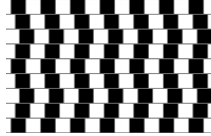
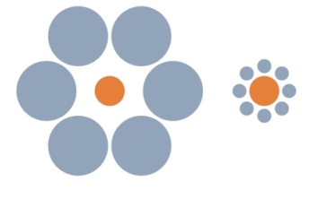
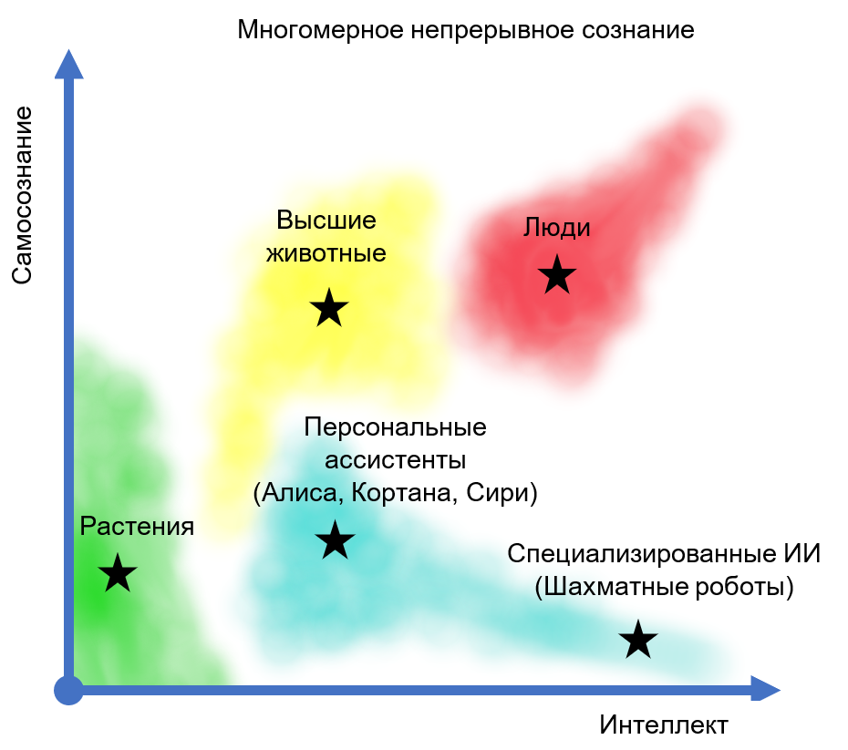
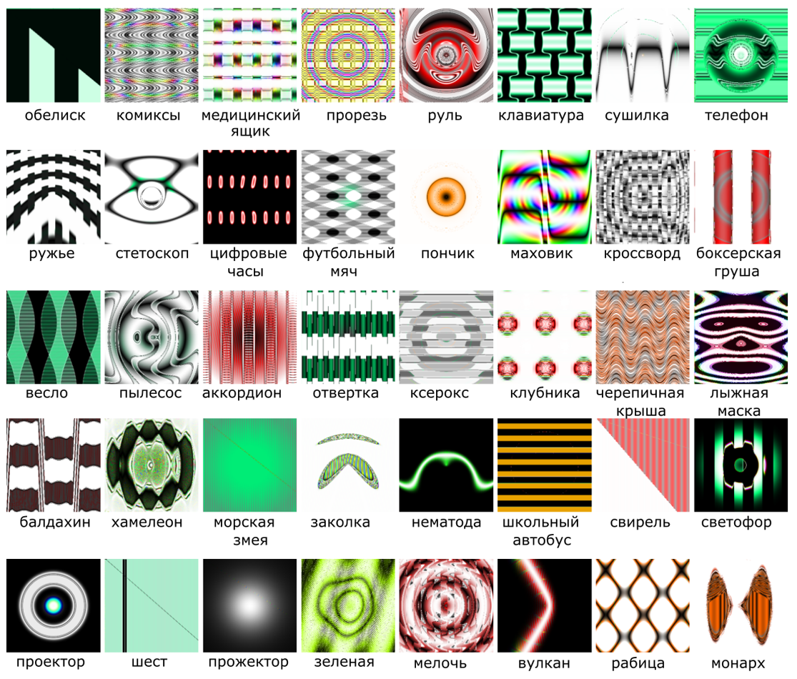

# Искусственный интеллект и кризис теорий сознания

## Введение

В настоящее время трудно найти тему более актуальную и быстро развивающуюся, чем искусственный интеллект. Возникающие проблемы и достигнутые результаты, затрагивая острые для многих аспекты, такие как монополия человека на разум и сознание, требуют философского исследования, например, проблема различия «сильного» и «слабого» искусственного интеллекта и, в особенности, проблема возможности создания «искусственного сознания». В данном реферате предпринимается попытка дать обзор современных взаимоотношений между философскими теориями сознания и текущим состоянием искусственного интеллекта (ИИ).

Философы существуют гораздо дольше, чем компьютеры, и пытаются решить некоторые вопросы, связанные с ИИ: как работает разум? Возможно ли, чтобы машины действовали разумно, как люди, и если да, то были ли у них реальные, «сознающие» умы? Каковы этические последствия интеллектуальных машин (Russel & Norvig, 2016)?

Следует, однако, заметить, что будет некорректным рассматривать текущий уровень развития ИИ как что-то стабильное, и тем более финальное. Можно найти вполне, казалось бы, обоснованные прогнозы, совершенно не выдерживающие испытания временем. Так в своей очень популярной книге «Гёдель, Эшер, Бах: эта бесконечная гирлянда» (Хофштадтер, 2001) математик и философ Дугласа Хофштадтер пишет, что «могут быть созданы программы, которые смогут обыгрывать [в шахматы] кого угодно, но они […] будут программами общего разума […] и будут обладать характером». Спустя лишь пару десятилетий, шахматные программы обыгрывают кого угодно, при этом, во-первых, не являясь системами искусственного интеллекта в полноценном (с точки зрения современного состояния компьютерных наук) смысле, и во-вторых, не проявляя, конечно, ни малейших признаков сознания в интуитивном понимании термина.

Заметка структурирована следующим образом:

* в первой части приводятся существующие определения «сознания» и обзор существующих теорий;
* во второй части приводятся определения ИИ и его классификация;
* в третьей части на отдельных примерах рассматривается применимость понятий, составляющих общее понятие сознания, к современному ИИ;
* в заключительной части приводятся некоторые проблемы, возникающие на стыке теорий сознания и современного ИИ.

## Теории сознания

В данном разделе приводятся существующие определения «сознания» и обзор существующих теорий сознания.

### Определение

Современная концепция сознания восходит к Джону Локку, который определял его как «восприятие того, что происходит в собственном разуме человека» (Samuel, 1756).

Современное определение термина «сознание» вызывает значительные трудности. Философы использовали термин «сознание» для четырёх основных тем: знание в целом, преднамеренность, интроспекция (и знания, которые она непосредственно порождает) и основанный на ощущениях опыт. Стюарт Сазерленд в своей словарной статье говорит, что сознание — это удивительное, но неуловимое явление: невозможно определить, что это такое, что оно делает и почему оно эволюционировало (Sutherland, 1989). Почти сорок таких значений «термина» были определены и разбиты на категории в зависимости от того, относятся ли они в основном к функции или к опыту; некоторые из них перекрывались, но другие, по-видимому, были взаимоисключающими - и этот список ни в коей мере не является исчерпывающим. Большинство из них можно рассматривать как выражение взглядов авторов на основу сознания или мнений о значимости тех или иных аспектов его содержания. Таким образом, перспективы достижения какого-либо единого, согласованного, независимого от теории определения сознания представляются отдалёнными (Vimal, 2006).

Можно, однако, определить набор несколько более определенных понятий, определяющих в определенной степени исходный термин. В число этих понятий входят (Schneider & Velmans, 2008):

* Осознанность: состояние или способность воспринимать, чувствовать или быть в сознании событий, объектов или сенсорных закономерностей. На этом уровне сознания данные чувств могут быть подтверждены наблюдателем, не обязательно подразумевая понимание. В биологической психологии осознанность определяется как восприятие человека или животного и когнитивная реакция на состояние или событие.
* Самосознание: способность к самоанализу и способность видеть себя как личность, отделённую от окружающей среды и других личностей.
* Чувствительность: способность осознавать (чувствовать, воспринимать или сознавать) своё окружение или иметь субъективный опыт. Чувствительность — это минималистический способ определения сознания.
* Разумность: часто определяемый как мудрость или способность организма или существа действовать с надлежащим суждением, умственная способность, которая является компонентом интеллекта или, в качестве альтернативы, может рассматриваться как дополнительная способность, помимо интеллекта, со своими собственными свойствами.
* Квалиа: отдельные моменты субъективного, сознательного опыта.
В третьей части эти понятия будут рассмотрены в применении к ИИ.

### «Классические» теории

История западной философии содержит богатую коллекцию литературы, которая восходит к временам древних философов, на такие темы, как человеческая природа, душа и разум. 

Произведения о природе сознания были найдены в трудах Аристотеля. Работы Рене Декарта в начале современной эпохи, однако, поставили в центр внимания предмет сознания и его связь с разумом и телом. Для Декарта он утверждал, что разум — это нефизическая субстанция, отличная от тела. Он также не верил, что существуют бессознательные психические состояния (Descartes, 2008). Известно также, что Г. У. Лейбниц верил в нематериальную природу психических «субстанций», которые он называл «монадами». Более того, он пытался различать восприятие и апперцепцию, то есть внешнее сознание и самосознание (Gennaro, 1999).

Теории сознания были сформулированы и направлены на то, чтобы уловить сложную природу предметного сознания. Однако исследования показывают, что не все теории сознания говорят о чем-то конкретном. Они различаются по своему существу, но также и в своих теоретических целях. Самое большое разделение большинства рассматриваемых теорий находится между двумя основными категориями: метафизическими теориями, которые направлены на локализацию сознания в общей онтологической схеме реальности, и более конкретными теориями, которые направлены на то, чтобы предложить в какой-то мере детальности природу, роль и особенности сознания.

#### Метафизические теории

Общие метафизические теории, как правило, предлагают ответы на «сознательную» (в противоположность «мыслительной») часть «психофизиологической проблемы». Постановка этой проблемы также восходит к Декарту (Skirry, 2016): «как эти две субстанции с совершенно разной природой могут вызывать причинно-следственное взаимодействие, чтобы дать человеку способность к добровольным телесным движениям и ощущениям?».

Метафизические теории пытаются ответить на вопрос о том, каков онтологический статус сознания по отношению к миру физических реальностей. Попытки ответить на эти вопросы привели к формулировкам теорий сознания дуалистами и физикалистами.

#### Дуалистические теории

Сторонники дуалистических теорий придерживаются мнения, что мир состоит из двух фундаментальных сущностей, таких как разум и материя. С психологической точки зрения, это мнение утверждает, что разум и тело функционируют раздельно, без какой-либо формы обмена. Дуалистические теории рассматривают, по крайней мере, некоторые аспекты сознания как выходящие за рамки физического. Это, в свою очередь, породило более конкретные теории из дуалистической школы, каждая из которых объясняет конкретные формы мыслей в дуалистической школе в отношении проблемы сознания. Дальнейшие конкретные области включают в себя субстанциональный дуализм, панпсихизм и т. д.

Усилия, направленные на решение проблемы сознания, очевидно, породили массив теорий, каждая из которых пыталась уловить определенную специфику. Поэтому такие теории сталкиваются с дилеммой предоставления ответов на «трудную проблему сознания».

«Трудная проблема сознания» — это проблема (Васильев, 2009) объяснения того, каким образом какая-либо физическая система способна порождать субъективный опыт. Данная проблема может быть сформулирована различными способами и включает в себя два важнейших вопроса:

* почему мозг порождает сознание?
* каким образом мозг порождает сознание?

Эти же вопросы можно отнести к искусственным разумным конструкциям, предварив его вопросом о принципиальной возможности существования подобных конструкций.

Для всех них истина аргументации в пользу дуалистических и других анти-физикалистких теорий сознания, которые направлены на обоснование анти-физикалистких выводов об онтологии сознания, выводится из очевидных пределов нашей способности в полной мере понимать качественные аспекты сознательных переживаний через физическое описание мозговых процессов от третьих лиц (Jackson, 1982).

#### Монизм

В отличие от дуализма монизм утверждает, что существует только одна фундаментальная субстанция. Существует монизм идеалистический (существует только ментальное), монизм нейтральный (существует единственная фундаментальная субстанция, не являющаяся ни ментальной, ни физической) и натуралистический (материалистический).

Натуралистический монизм предполагает, что единственной существующей реальностью является та, которая описывается современной естественной наукой. Другими словами, современная наука описывает мир полным и исчерпывающим способом. Существует несколько разных подходов к решению проблемы сознания в рамках этой общей установки.

Монистическая теория разума, часто называемая физикализмом, утверждает, что разум не отделен от тела, что психические состояния — это физические состояния. Большинство современных философов разума являются физикалистами того или иного типа, а физикализм, по крайней мере в принципе, допускает возможность сильного ИИ (см. «Сильный и слабый искусственный интеллект»).

На первый взгляд может показаться, что в свете применения теорий сознания к искусственному интеллекту имеет смысл рассматривать только теории, относящиеся к натуралистическому монизму, однако не все философы, считают, что этот так.

##### Дуализм свойств

В контексте «искусственного сознания» следует рассмотреть так называемый «дуализм свойств» Дэвида Чалмерса (Chalmers, 1996). 

Согласно картезианскому дуализму, существует два вида субстанций: материальная субстанция, которая находится в пространстве и времени, и психическая субстанция, чья характеристика есть мысль. Таким образом, каждый человек состоит из этих двух субстанций — материи и разума, которые совершенно различны в своем роде и могут существовать независимо друг от друга. Но как эти две субстанции взаимодействуют? Декарт указывает на так называемую шишковидную железу и взаимодействующих с ней «животных духов», которые являются посредниками между телом и разумом. Таким образом, мы остаемся со строго физическим объяснением значительной части умственной деятельности в сильно дуалистической концепции разума.

Чтобы избежать этой проблемы, дуализм свойств утверждает (Salazar, et al., 2019), что ментальность следует понимать с точки зрения свойств, а не с точки зрения вещей: вместо того, чтобы сказать, что есть определенные виды вещей, которые являются разумом, мы говорим, что иметь разум — значит обладать определенными свойствами. Свойства — это свойства вещей; свойства приписываются веществам, которыми ими обладают. Таким образом, в соответствии с дуализмом свойств существуют различные виды свойств, которые относятся к единственному виду вещества, материальному веществу: есть физические свойства, такие как обладание определенным цветом или формой, и есть психические свойства, такие как обладание определенными убеждениями, желаниями и восприятиями.

Дуализм свойств противопоставляется дуализму субстанций, поскольку он утверждает только один вид субстанций, но противопоставляется и онтологическим монистическим взглядам, таким как материализм или идеализм, согласно которым все, что существует (в том числе и свойства), представляет собой одно и то же. Обычно дуализм свойств выдвигается как альтернатива редуктивному физикализму (см. «Типовая теория идентичности») - взгляду, согласно которому все свойства в мире, по крайней мере, в принципе, могут быть сведены к физическим свойствам или отождествлены с ними.
Вероятно, самым известным аргументом в пользу дуализма собственности является «аргумент знания», выдвинутый Фрэнком Джексоном (Jackson, 1982). Этот аргумент включает воображаемый пример Мэри, блестящего нейробиолога, которая была воспитана в черно-белой комнате. Она знает все, что нужно знать о физических фактах, связанных со зрением, но она никогда не видела красного цвета (или любого другого цвета, если уж на то пошло). Однажды Мэри выходит из черно-белой комнаты и видит красный помидор. Джексон утверждает, что Мэри узнает что-то новое, увидев красный помидор - она узнает, как выглядит красный. Поэтому, чтобы узнать о мире, нужно нечто большее, чем просто физические факты, и в мире есть больше свойств, чем просто физические свойства.

Дуализм свойств в более требовательном смысле (иногда называемый эмерджентизмом), утверждает, что есть два вида свойств, физические и ментальные, и что ментальные свойства — это нечто большее, чем физические свойства. Это, в свою очередь, можно понять, по крайней мере, двумя способами. Во-первых, быть «сверх и выше» может означать, что психические свойства обладают самостоятельными причинно-следственными свойствами и несут ответственность за последствия в физическом мире. Это известно как «нисходящая причинно-следственная связь». В этом смысле дуалист такого рода должен верить, что, скажем, психическое свойство иметь желание выпить — это то, что на самом деле заставляет вас встать и подойти к холодильнику, в отличие от некоторого материального свойства вашего мозга, являющегося причиной, как, например, активация некоторых групп нейронов. Во-вторых, быть чем-то «сверх и выше» должно означать отрицание сверхъестественного. Другими словами, для того чтобы ментальные свойства были по-настоящему независимы от физических свойств, они должны быть способны изменяться независимо от своих физических оснований. Таким образом, дуалист, отрицающий супервентность, должен согласиться с возможностью того, что два человека могут находиться в разных психических состояниях, например, один может испытывать боль, а другой — нет, имея при этом одни и те же состояния мозга.

Целесообразно кратко рассмотреть следующие теории сознания, которые, как будет показано ниже, наиболее тесно связаны с разработками в области искусственного интеллекта:

#### Типовая теория идентичности

В «типовой теории идентичности» (Philosophy Index, 2020) разума считается, что состояния и процессы разума идентичны состояниям и процессам мозга. Типовая теория идентичности, или типовой физикализм — это теория о том, что деятельность мозга и соответствующие ментальные процессы являются типологически идентичными.
Термин тип в данной версии теории тождественности предназначен для обозначения разницы между типом и токеном, в котором тип является категорией, а токен - экземпляром члена этой категории. Например, фраза «больше, и больше, и больше» содержит два типа слов (типы – «больше» и «и») и пять токенов (три токена типа «больше» и два токены типа «и»).

##### Частная (токен) идентичность

Токен-идентичность отличается от типовой идентичности тем, что отношения между физическим и ментальным событием более специфичны для данного события. Специфический токен физического события в мозге соответствует специфическому токену психической деятельности. Теория токен-идентичности в более широком смысле гласит, что психические и физические процессы, как правило, относятся к одному и тому же.  Токен-физикализм, по сути, является тем же самым, что и дуализм свойств, который утверждает, что психические свойства мозга (ментальные токены) соответствуют физическим свойствам мозга (физические токены) — оба они аналогичны друг другу и относятся к одному и тому же физическому объекту, но отличаются онтологически тем, что ментальные процессы имеют иное качество, чем их физические аналоги.

#### Логический бихевиоризм

Логический бихевиоризм есть (Прист, 2000) теория о том, что быть в ментальном состоянии означает быть в бихевиоральном состоянии. Мышление, надежда, восприятие, воспоминание и так далее — всё это должно пониматься либо как поведение, либо как обладание сложной диспозицией или склонностью к поведению. Сознание не является чем-то иным, помимо поведения, где под «поведением» подразумевают доступное общему наблюдению телесное поведение. Подобное сведение ментального к поведенческому логические бихевиористы отстаивают в качестве лингвистического тезиса — тезиса о том, как возможно употреблять в нашем языке психологические понятия типа «образ», «восприятие», «мысль», «память». И это, согласно логическим бихевиористам, возможно потому, что любое предложение (или набор предложений) о сознаниях может быть без изменения значения переведено в любое предложение (или набор предложений) относительно доступного общему наблюдению поведения. В этом суть логического бихевиоризма. До тех пор, пока наша психологическая терминология не станет обозначать внешнее поведение, она не будет обладать значением.

Логические бихевиористы различаются между собой по вопросу, почему это должно быть так. Некоторые полагают, что мы не сможем определять, истинны или ложны психологические утверждения, если одновременно они не будут и утверждениями о поведении. Другие же придерживаются мнения, что психологические понятия не играли бы роли в нашем общем языке, если бы не существовало общедоступных критериев для их употребления. Все логические бихевиористы согласны в том, что, если наш психологический язык не будет описывать поведение, он вообще будет не о чём.

#### Теория интегрированной информации

Теория интегрированной информации (ТИИ) предлагает объяснение природы и источника сознания. Первоначально предложенная Джулио Тонони (Tononi, 2004; Fallon, 2020) в 2004 году, она утверждает, что сознание идентично определённому виду информации, представление которой требует физической, а не просто функциональной интеграции, и которая может быть измерена математически в соответствии с ϕ-метрикой.

Согласно ТИИ, сознание требует группировки элементов внутри системы, которые имеют физическую причинно-следственную силу друг с другом. Это, в свою очередь, подразумевает, что только реентерабельная архитектура, состоящая из циклов обратной связи, будь то нейронная или вычислительная, будет реализовывать сознание. Такие объединения имеют значение не только для внешних наблюдателей, но и для самих себя. Это представляет собой интегрированную информацию. Из различных объединений внутри системы, обладающих такой причинно-следственной силой, одна будет обладать такой силой в максимальной степени. Этот локальный максимум интегрированной информации идентичен сознанию.

ТИИ стремится, среди прочего, не только претендовать на существование шкалы сложности сознания, но и обеспечить теоретический подход к точной количественной оценке полноты переживаний для любой сознательной системы. Для этого требуется вычислить максимальное количество интегрированной информации в системе. ТИИ называет это значение ϕ-метрикой системы, которое может быть выражено численно, по крайней мере, в принципе.

Φ — это количество причинно-следственной информации, которое может быть интегрировано самым слабым информационным звеном подмножества элементов. Комплекс — это подмножество элементов с φ>0, которое не является частью подмножества более высоких ϕ. Теория также утверждает, что качество сознания определяется информационными связями между элементами комплекса, которые обусловлены значениями эффективной информации между ними. Наконец, каждый конкретный сознательный опыт определяется, в любой выбранный момент времени, значениями переменных, опосредующих информационные взаимодействия между элементами комплекса.

#### Модель множественных набросков

Дэниел Деннет (Dennett D. , 1991) утверждает, что наше современное понимание сознания находится под неоправданным влиянием идей Рене Декарта. Чтобы показать почему, он начинает с описания ϕ-иллюзии. В этом эксперименте последовательно вспыхивают два разных цветных источника света, с угловым разделением в несколько градусов на уровне глаз. Если интервал между вспышками меньше секунды или около того, то первый вспыхивающий источник, кажется, перемещается в положение второго. Более того, кажется, что источник меняет цвет по мере перемещения по полю зрения. Зеленый источник, кажется, становится красным по мере того, как он переходит в положение красного источник. Деннет спрашивает, как мы можем видеть, как источник меняет цвет, прежде чем появится второй источник.

В соответствии с моделью, существует множество сенсорных входов от определенного события, а также различные интерпретации этих входов. Сенсорные входы поступают в мозг и интерпретируются в разное время, поэтому данное событие может привести к последовательности разветвлений, представляющей собой эквивалент множественных набросков истории. Как только каждая дискриминирующая функция выполнена, она становится доступной для формирования поведения.
Как и ряд других теорий, «модель множественных набросков» понимает, что на сознательное переживание требуется время, так что восприятия не мгновенно возникают в сознании во всем своем богатстве.

## Отдельные аспекты понятия «сознание»

Довольно условно, но понятие «сознание» можно разделить на следующие составляющие части.

### Самосознание

Человек осознает не только окружающий его мир, но и самого себя: свою деятельность, свое тело, свою психическую жизнь. Он является, таким образом, само-осознающим. Самосознание можно понимать как осознание себя. Но субъект самосознания — это не просто осознание того, что кто-то является самим собой, как если бы он увидел старую фотографию, не осознавая того, что она принадлежит ему самому. Скорее, для самосознательного субъекта очевидно, что он сам является объектом осознания.

Факт существования самосознания человека обычно не вызывает вопросов, однако до рассмотрения сознания искусственного интеллекта интересно рассмотреть в некотором смысле промежуточный вопрос о самосознании животных.

#### Самосознание животных и зеркальный тест

Смысл, в котором можно сказать, что животные (или человеческие младенцы) имеют сознание или самоощущение, горячо обсуждается; его часто называют дискуссией о сознании животных. Наиболее известной методикой исследования в этой области является зеркальный тест, разработанный Гордоном Гэллапом (Gallup, 1970). За последние 50 лет во многих исследованиях были обнаружены свидетельства того, что животные узнают себя в зеркалах. Сообщалось о самосознании по этому критерию у шимпанзе, бонобо, орангутанов и горилл, слонов, дельфинов и косаток.

Зеркальный тест измеряет самосознание, определяя, может ли животное распознать свое отражение в зеркале как изображение самого себя.

Это достигается путем скрытой маркировки животного краской без запаха и дальнейшим наблюдением за тем, реагирует ли животное, осознавая, что краска находится на его собственном теле. Такое поведение может включать в себя поворот и смещение тела, чтобы лучше видеть разметку в зеркале, или тыкать пальцем в разметку на собственном теле во время просмотра в зеркале.

Проведение схожего теста с искусственными системами, стремящимися моделировать сознание, может принести интересные результаты (см. «Роботы и зеркальный тест»).

### Интенциональность

Помимо указанных, важной характеристикой сознания является понятие интенциональности, введённое в современную философию Францем Бретано, как критерий различения ментальных и физических феноменов. Интенциональность определяется как способность разума и психических состояний (по Н. Д. Левитову — это «целостная характеристика психической деятельности за определенный период времени, показывающая своеобразие протекания психических процессов в зависимости от отражаемых предметов и явлений действительности, предшествующего состояния и свойств личности» (Левитов, 1964) быть направленными на, представлять или обозначать какие-либо вещи, свойства или ситуации.

Интересно, что понятие интенциональности рассматривалось в одноименной книге (Searle, 1983) Джоном Сёрлом — одним из самых известных и жёстких критиков искусственного интеллекта.

Понятие о человеческом разуме, основанное на здравом смысле, предполагает атрибуцию психических состояний, которые имеют «содержание» (Allen, 2001). Например, чтобы иметь веру, нужно иметь веру в что-то, а чтобы иметь желание, нужно иметь желание чего-то. Философы называют такие состояния «интенциональными». Термин «интенциональный» и его разновидности имеют как обычный смысл, так и философский. Обычный смысл («намеренный») подразумевает цель, и именно в этом смысле можно сказать, что действия являются преднамеренными. Однако интенциональность не ограничивается «народно-психологическими» понятиями, такими как вера и желание.

Философы не сходятся во мнении о правильном способе определения интенциональности. Они также не сходятся во мнении, что она может быть определена таким образом, что вопросы о разуме могут быть трактованы эмпирически. Если преднамеренность нельзя трактовать эмпирически, то значительная часть нашего «здравого смысла» в отношении разума не найдет места в когнитивистике (см., например, (Churchland, 1986), поэтому эта тема имеет первостепенное значение для когнитивистики. Тупиковая ситуация, вызванная философскими разногласиями по поводу интенциональности, часто заставляет эмпирических ученых отворачиваться от философского теоретизирования этих вопросов.

### Квалиа

Термин «qualia» был введен в философскую литературу в ее современном понимании в 1929 г. К. И. Льюисом.
Квалиа часто называют феноменальными свойствами опыта, а переживания, которые имеют квалиа, называют феноменологически сознательными. Феноменологическое сознание часто контрастирует с интенциональным. Некоторые психические состояния, например, чувственный опыт, ясно имеют как феноменологические, так и интенциональные аспекты. Менее понятно, имеют ли все феноменологические состояния также интенциональный аспект, и все ли интенциональные состояния также имеют феноменологический аспект. Характер взаимосвязи между феноменологическим сознанием и интенциональным в последнее время вызвал значительные философские дискуссии. Некоторые философы думают, что феноменологическое сознание сводится к интенциональному содержанию, в то время как другие думают, что редукция идет в другом направлении. Другие же философы отрицают оба утверждения (см. «Сильный и слабый искусственный интеллект»).
Рискнем утверждать, что квалиа является самым «человеческим» аспектом сознания, сложно определяемым, и как следствие вызывающим наибольшие трудности на пути создания ИИ.

## Искусственный интеллект

В этой части приводятся определения ИИ и его классификация.

### Определения искусственного интеллекта

В 1950 году Алан Тьюринг написал пророческую статью об искусственном интеллекте (Turing, Computing Machinery and Intelligence, 1950), которая начитается с фразы: "Рассмотрим вопрос «Может ли машина думать?». Поскольку, как он указывает, эти термины недостаточно точно определены, Тьюринг предлагает определять думающие субъекты через игру, называемую «игрой в имитацию», широко известную сейчас как тест Тьюринга.

Тестирование состоит в том, чтобы программа в течение пяти минут вела разговор (через напечатанные сообщения) с дознавателем. Затем допрашивающий должен угадать, разговаривает ли он с программой или с человеком; программа проходит тест, если она обманывает допрашивающего в 30% случаев. Тьюринг предположил, что к 2000 году компьютер с памятью 109 единиц может быть запрограммирован достаточно хорошо, чтобы пройти тест. Он ошибался — программы еще не одурачили искушенного судью.

С другой стороны, многие люди были обмануты, когда не знали, что могут общаться с компьютером. Программа ELIZA и интернет-чаты, такие как MGONZ и NATACHATA, неоднократно обманывали своих корреспондентов, а чат-бот CYBER LOVER привлек внимание правоохранительных органов из-за своей склонности к принуждению товарищей по чату к разглашению достаточного для «кражи личности» количества персональной информации (Russel & Norvig, 2016). Конкурс на приз Лёбнера, проводимый ежегодно с 1991 года, является самым продолжительным конкурсом, похожим на «тест Тьюринга». Эти конкурсы способствовали построению лучших моделей ошибок человеческого набора текста. Сам Тьюринг изучил широкий спектр возможных возражений против возможности использования интеллектуальных машин, в том числе практически все те, которые были подняты в течение полувека с момента появления его работы.

В современном понимании понятие искусственный интеллекта вводится Джоном Маккарти (McCarthy, 2007).
По Маккарти искусственный интеллект — это наука и техника для создания интеллектуальных машин, особенно интеллектуальных компьютерных программ. Это связано с близкой задачей использования компьютеров для понимания человеческого интеллекта, но искусственный интеллект не должен ограничиваться методами, которые являются биологически наблюдаемыми.

Под интеллектом здесь понимают «вычислительную» часть способности достигать целей в мире. Различные виды и степени интеллекта встречаются у людей, у многих животных и у некоторых машин.

На сегодняшний день нет точного определения понятия «интеллект», которое не зависело бы от его связи с человеческим интеллектом. Проблема заключается в том, что мы пока не можем в общих чертах охарактеризовать, какие вычислительные процедуры мы хотим назвать интеллектом. Мы понимаем некоторые механизмы интеллекта, но не все.

Вопрос «Умна ли эта машина или нет?» — неправильный вопрос. Интеллект включает в себя множество механизмов, и исследования ИИ открыли, как заставить компьютеры выполнять лишь некоторые из них. Если для выполнения задачи требуются только хорошо понятные сегодня механизмы, то компьютерные программы могут дать очень впечатляющую производительность на этих задачах. Такие программы следует считать «умными».

ИИ не всегда симулирует человеческий интеллект. С одной стороны, мы можем узнать кое-что о том, как сделать так, чтобы машины решали проблемы, наблюдая за другими людьми или просто наблюдая за нашими собственными методами. С другой стороны, большая часть работы в ИИ связана с изучением проблем, которые мир представляет для интеллекта, а не с изучением людей или животных. Исследователи ИИ свободны в использовании методов, которые не наблюдаются в людях, либо которые требуют гораздо больше вычислительной мощности, чем доступно человеку.

Компьютерные программы обладают достаточной скоростью и памятью, но их возможности соответствуют интеллектуальным механизмам, которые разработчики достаточно хорошо понимают, чтобы вкладывать в программы. Некоторые способности, которые дети обычно не развивают до подросткового возраста, могут быть заложены, а некоторые способности, которыми обладают двухлетние дети, все еще не реализованы. Дело осложняется еще и тем, что когнитивным наукам до сих пор не удалось точно определить, каковы же человеческие способности. Вполне вероятно, что организация интеллектуальных механизмов искусственного интеллекта может с успехом отличаться от организации интеллектуальных механизмов у людей.

Любопытно, что в 2007 году Маккарти повторяет упомянутый во введении ошибочный прогноз Дугласа Хофштадтера, сделанный в 1970 году в отношении шахмат, в это раз в отношении игры «го», также известной как «падук». Он говорит о том, что рассмотрение игровой позиции в Го, в отличие от шахмат, требует специальных «интеллектуальных действий», и не компенсируется вычислительной мощностью. Тем не менее, современный алгоритм AlphaZero способен играть и в шахматы, и в го на уровне выше гроссмейстерского без изменения самого алгоритма (Silver, 2017).

Тест Тьюринга подвергался различной критике, но с точки зрения рассматриваемого предмета особый интерес представляет следующее возражение.

#### Возражение с точки зрения сознания

Это возражение было высказано Джефферсоном на Листеровских чтениях 1949 года (Jefferson, 1949): «До тех пор, пока машина не сможет написать сонет или сочинить музыкальное произведение, побуждаемая к тому собственными мыслями и эмоциями, а не за счет случайного совпадения символов, мы не можем согласиться с тем, что она равносильна мозгу, т.е. что она может не только написать эти вещи, но и понять то, что ею написано. Ни один механизм не может чувствовать (а не просто искусственно индицировать, для чего требуется достаточно несложное устройство) радость от своих успехов, горе от постигших его неудач, удовольствие от лести, огорчение из-за совершенной ошибки, не может быть очарованным противоположным полом, не может сердиться или быть удрученным, если ему не удается добиться желаемого».

Это рассуждение, по-видимому, означает отрицание «игры в имитацию». Согласно самой крайней форме этого взгляда, единственный способ, с помощью которого можно удостовериться в том, что машина может мыслить, состоит в том, чтобы стать машиной и осознавать процесс собственного мышления. Свои переживания можно было бы потом описать другим, но, конечно, подобное сообщение никого бы не удовлетворило. Точно так же, если следовать этому взгляду, то окажется, что единственный способ убедиться в том, что данный человек действительно мыслит, состоит в том, чтобы стать именно этим человеком. Фактически эта точка зрения является солипсистской.

Солипсизм же как радикальный субъективный идеализм часто подвергался критике со стороны известных философов («солипсизм — это безумная уверенность в том, что кроме меня больше ничего не существует» (Gardner, 1983).
Классификация искусственного интеллекта

Поскольку исследования ИИ направлены на то, чтобы машины эмулировали работу человека, в качестве критерия для определения типов ИИ используется степень, в которой система ИИ может воспроизводить человеческие возможности. Таким образом, в зависимости от того, насколько машина сравнима с человеком с точки зрения универсальности и производительности, искусственный интеллект можно отнести к одному среди множества типов искусственного интеллекта.

При такой системе ИИ, который может выполнять более похожие на человека функции с эквивалентным уровнем мастерства, будет считаться более развитым типом ИИ, в то время как ИИ, который имеет ограниченные функциональные возможности и производительность, будет считаться более простым и менее развитым типом.

На основе этого критерия существуют два способа общей классификации ИИ. Один из них основан на классификации машин с искусственным интеллектом на основе их сходства с человеческим разумом, а также их способности «думать» и, возможно, даже «чувствовать» как людей. Согласно этой системе классификации, в теории искусственного интеллекта существует четыре типа систем, основанных на ИИ (Joshi, 2016):

* реактивные машины;
* машины с ограниченной памятью;
* машины с моделью психического состояния;
* машины с самосознанием.

#### Реактивные машины

Это старейшие формы систем ИИ, которые имеют крайне ограниченные возможности. Они эмулируют способность человеческого разума реагировать на различные виды стимулов. Эти машины не имеют функциональности, основанной на памяти. Это означает, что такие машины не могут использовать ранее приобретенный опыт для обоснования своих нынешних действий, т. е. они не обладают способностью «учиться». Эти машины могут использоваться только для автоматического реагирования на ограниченный набор или комбинацию входов. Они не могут полагаться на память для улучшения их работы на основе того же опыта. Популярным примером реактивной машины ИИ является машина IBM Deep Blue, которая выиграла у шахматного гроссмейстера Гарри Каспарова в 1997 году.

#### Машины с ограниченной памятью

Машины с ограниченной памятью — это машины, которые не только обладают возможностями чисто реактивных машин, но и способны учиться принятию решений на основе исторических данных. Почти все существующие приложения, о которых мы знаем, относятся к этой категории ИИ. Все современные системы ИИ, например, использующие глубокое обучение, обучаются большим объемам обучающих данных, которые они хранят в своей памяти, чтобы сформировать эталонную модель для решения будущих задач.

#### Машины с моделью психического состояния

В то время как два предыдущих типа ИИ встречались и встречаются в изобилии, следующие два типа ИИ существуют в настоящее время либо как концепция, либо как проводимая в данный момент работа. ИИ с моделью психического состояния — это следующий уровень систем искусственного интеллекта, которые исследователи в настоящее время внедряют на самом начальном этапе. Искусственная модель психического сможет лучше понять сущности, с которыми ИИ взаимодействует, выявляя их потребности, эмоции, убеждения и мыслительные процессы. Чтобы по-настоящему понять человеческие потребности, машины искусственного интеллекта должны будут воспринимать людей как индивидуумов, чей разум может быть сформирован множеством факторов, по сути, «пониманием» человека.

#### Машины с самосознанием

Это заключительная стадия развития ИИ, которая в настоящее время существует лишь гипотетически. Самосознающим ИИ является машина, эволюционировавшая так близко к человеческому мозгу, что у него развилось самосознание. Создание такого типа ИИ, который находится на расстоянии десятилетий, если не столетий от реализации, является и всегда будет конечной целью всех исследований ИИ. Этот тип ИИ будет не только способен понимать и вызывать эмоции в тех, с кем он взаимодействует, но и иметь собственные эмоции, потребности, убеждения и потенциально желания.

### Альтернативная классификация

Альтернативной системой классификации, которая более широко используется в техническом плане, является классификация технологии на «узкий искусственный интеллект», «общий искусственный интеллект» и «искусственный супер-интеллект».

#### Узкий искусственный интеллект

Этот тип искусственного интеллекта представляет весь существующий ИИ, включая даже самый сложный и способный ИИ, когда-либо созданный на сегодняшний день. Искусственный узкий интеллект относится к системам ИИ, которые могут выполнять конкретную задачу только автономно, используя способности, подобные человеческим.

#### Общий искусственный интеллект

Общий искусственный интеллект (ОИИ) — это способность искусственного интеллекта изучать, воспринимать, понимать и функционировать полностью как человек. Эти системы смогут самостоятельно формировать множество компетенций и формировать связи и обобщения в различных областях, значительно сокращая время, необходимое для обучения.

#### Искусственный супер-интеллект

Искусственный супер-интеллект (ИСИ), в дополнение к воспроизведению многогранного интеллекта человека, будет значительно лучше во всем, что он делает, благодаря огромному объему памяти, более быстрой обработке и анализу данных, а также возможностям принятия решений. Развитие ОИИ и ИСИ приведет к появлению сценария, который обычно называют сингулярностью.

### Сильный и слабый искусственный интеллект

Еще одно очень важной для рассмотрения феномена сознания в приложении к ИИ является разделение «думающих машин» на «слабый» и «сильный» искусственный интеллект.

#### Слабый ИИ: могут ли машины действовать разумно?

Утверждение о том, что машины могут действовать так, как если бы они были раз	умны, философы называют слабой гипотезой ИИ, а утверждение о том, что машины, которые так делают, на самом деле мыслят (а не просто имитируют мышление), называется сильной гипотезой ИИ.

Большинство исследователей ИИ воспринимают слабую гипотезу об ИИ как само собой разумеющееся, и их не волнует сильная гипотеза об ИИ — до тех пор, пока их программа работает, их не волнует, называется ли вы это симуляцией интеллекта или реальным интеллектом.

Философов интересует проблема сравнения двух архитектур — человеческой и машинной. Более того, они традиционно ставят вопрос не о максимизации ожидаемой полезности, а о том, «Могут ли машины думать?» и «Могут ли машины сознавать?» (Russel & Norvig, 2016).

Сам Тьюринг изучил широкий спектр возможных возражений против возможности интеллектуальных машин, в том числе практически все те, которые были высказаны за полвека с момента появления его работы (Turing, Computing Machinery and Intelligence, 1950). В настоящее время мало кто сомневается в существовании ИИ в узком смысле. Известный футуролог Рей Курцвейл пишет (Kurzweil, 2005), слабый ИИ — это машинный интеллект, равный или превосходящий человеческий интеллект для решения конкретных задач. Каждый раз, когда вы посылаете электронное письмо или звоните по мобильному телефону, интеллектуальные алгоритмы направляют информацию. ИИ-программы диагностируют заболевания сердца, летающие и сухопутные транспортные средства, направляют автономное оружие, принимают автоматизированные инвестиционные решения на триллион долларов и направляют производственные процессы.

Многие философы утверждали, что машина, которая пройдет тест Тьюринга, на самом деле не будет думать, а будет лишь симуляцией мышления.

#### Сильный ИИ: могут ли машины действительно думать?

Вернемся к «возражению от сознания» к тесту Тьюринга, пока машина не сможет написать сонет или сочинить концерт из-за прочувствованных мыслей и эмоций, и не только написать что-то, но и знать, что она это написала, — машина не равна мозгу.  Машина должна осознавать свои собственные психические состояния и действия.

Интересен ответ самого Тьюринга на возражение. Он мог бы представить причины, по которым машины на самом деле могут быть сознательными (или иметь феноменологию, или иметь намерения). Вместо этого он утверждает, что вопрос так же плохо сформулирован, как и вопрос: «Могут ли машины думать?». Ведь почему мы должны настаивать на более высоких стандартах для машин, чем для людей? Ведь в обычной жизни у нас никогда не бывает прямых доказательств внутренних психических состояний других людей. Тем не менее, Тьюринг говорит: «Вместо того, чтобы постоянно спорить по этому поводу, принято иметь вежливое соглашение, что все думают».

Ключевой момент, обозначенный Джефферсоном, на самом деле связан с феноменологией или изучением непосредственного опыта: машина должна действительно испытывать эмоции. Другие сосредотачиваются на интенциональности, т. е. на вопросе о том, являются ли предполагаемые убеждения, желания и другие представления машины на самом деле «о» чем-то реальном. Как было рассмотрено в первой части, сочетание возможности получения феноменологического опыта и интенциональности, составляет неотъемлемые компоненты сознания.

Можно утверждать, что «реальность» мышления в сильном смысле (т. е. возможность искусственного интеллекта (Holland, 2003) является необходимым условием для возможности искусственного сознания. Следовательно, основной философский вопрос об искусственном интеллекте заключается в том, могут ли машины быть сознательными.

Возвращаясь в Курцвейлу, он задает следующий вопрос: «Каковы перспективы создания «сильного» ИИ, который я называю машинным интеллектом со всем спектром интеллекта человеческого?» Мы способны удовлетворить требования к аппаратному обеспечению. Курцвейл считает, что нам нужно около 10 квадриллионов вычислений в секунду, чтобы обеспечить функциональный эквивалент для всех областей мозга. Таким образом, в настоящее время спор о «сильном ИИ» сосредоточен на алгоритмах. Чтобы понять принципы человеческого интеллекта, нам нужно выполнить «обратное проектирование» человеческого мозга. Позиция Курцвейла не является бесспорной (см. «Китайская комната»).

Курцвейл замечает, что здесь прогресс намного больше, чем большинство людей думает. Пространственное и временное разрешение сканирования мозга прогрессирует экспоненциально, примерно удваиваясь с каждым годом. Инструменты сканирования могут видеть отдельные межнейронные связи и наблюдать за их активацией в режиме реального времени. У нас уже есть математические модели и моделирование нескольких десятков областей мозга, в том числе мозжечка, который включает более чем половину нейронов. Разумно сделать вывод, что через два десятилетия у нас будут эффективные модели для большей части мозга.

## Современный искусственный интеллект и основные аспекты феномена сознания.

Исходя из изложенного во второй части реферата можно предполагать, что, так как возникновению самосознания должно предшествовать возникновение сознания, с точки зрения эволюции ИИ сознание должно возникать в наиболее совершенных ИИ с моделью психического состояния (англ. Theory of Mind). В связи с этим стоит остановиться на этом понятии подробнее.

### Модель психического состояния.

Англоязычный термин theory of mind (дословно «теория разума») проистекает из невозможности непосредственного наблюдения психических процессов другого живого существа. Каждый человек может удостовериться в существовании собственного мышления лишь посредством интроспекции.

Обладать моделью психического состояния — означает быть способным воспринимать как свои собственные убеждения, намерения, знание, так и переживания других людей, — что позволяет объяснять и прогнозировать их поведение (Premack & Woodruff, 1978).

Важно отметить, что есть данные о способности животных, по крайней мере приматов, строить модели психического состояния.

Существует несколько теорий такой модели, из которых в контексте искусственного интеллекта особый интерес предоставляет вычислительная модель психического состояния («вычислительная теория разума»).

#### Классическая вычислительная теория разума

Достижения в области вычислений открыли путь к идее о том, что сам ум является вычислительной системой — это позиция, известная как вычислительная теория разума (ВТР). Ключевая задача, стоящая перед ВТР, состоит в том, чтобы объяснить, что имеется в виду, когда говорят, что ум «вычисляет». Вторая задача — доказать, что разум «вычисляет» в прямом смысле.

Согласно ВТР, разум — это вычислительная система, похожая по важным параметрам на машину Тьюринга, а основные умственные процессы (например, рассуждения, принятие решений и решение задач) — это вычисления, похожие на выполняемые машиной Тьюринга (Rescorla, 2020).

ВТР не просто придерживается мнения, что разум похож на вычислительную систему. ВТР считает, что разум буквально является вычислительной системой. Конечно, известные искусственные вычислительные системы изготавливаются из кремниевых чипов или аналогичных материалов, в то время как человеческое тело состоит из плоти и крови. Но ВТР считает, что эта разница маскирует более фундаментальное сходство, которое мы можем определить с помощью Тьюринг-подобной вычислительной модели. Предлагая такую модель, мы заранее отвлекаемся от физических деталей. Мы получаем абстрактное вычислительное описание, которое может быть физически реализовано различными способами (например, через кремниевые чипы, нейроны или шкивы и рычаги). ВТР считает, что подходящая абстрактная вычислительная модель предлагает буквально верное описание основных психических процессов.

Этот формализм кажется слишком ограничительным в нескольких отношениях:

* Машины Тьюринга выполняют чисто символические вычисления. Входы и выходы представляют собой символы, записанные в ячейки памяти. Напротив, разум получает сенсорные входы (например, стимуляция сетчатки глаза) и производит моторный выход (например, мышечные активации). Полная теория должна описывать, как умственные вычисления взаимодействуют с сенсорными входами и моторными выходами;

* Машина Тьюринга имеет бесконечный объем дискретной памяти. Обычные биологические системы имеют конечный объем памяти. Правдоподобная психологическая модель должна заменить бесконечное хранилище памяти большим, но конечным хранилищем памяти;

* Современные компьютеры обладают оперативной памятью: адресуемые ячейки памяти, к которым центральный процессор может получить прямой доступ. Память Тьюринг-машины не является адресуемой. Центральный процессор может получить доступ к ячейкам только путем последовательного доступа к промежуточным ячейкам. Вычисления без адресуемой памяти безнадежно неэффективны. Адресуемая память дает лучшую модель разума, чем неадресуемая память (Gallistel & King, 2009);

* Машина Тьюринга имеет центральный процессор, который работает последовательно, выполняя по одной команде за раз. Другие вычислительные формализмы смягчают это предположение, позволяя нескольким процессорам работать параллельно. Классические вычисления могут допускать параллельные вычисления для общих математических обработок, которые охватывают как последовательные, так и параллельные вычисления (Fodor & Pylyshyn, Connectionism and Cognitive Architecture: A Critical Analysis, 1988);

* Вычисления типа Тьюринга детерминированы: общее вычислительное состояние определяет последующее вычислительное состояние. Вместо этого можно допускать стохастические вычисления. В стохастической модели текущее состояние не диктует уникальное следующее состояние. Скорее, существует определенная вероятность того, что машина перейдет из одного состояния в другое.

ВТР утверждает, что умственная деятельность является «Тьюринг-подобным вычислением», позволяя эти и другие отклонения от собственно формализма Тьюринга.

Следует отметить, что современные вычислительные системы в полной мере преодолевают указанные ограничения.
Хилари Путнэм (Putnam, 1967) ввел ВТР в философию под названием «машинный функционализм». Он противопоставил свою позицию логическому бихевиоризму и теории идентификации типа. Каждая позиция направлена на раскрытие природы психических состояний, включая пропозициональные установки (например, убеждения), ощущения (например, боль) и эмоции (например, страх). Согласно логическому бихевиоризму, психические состояния являются поведенческими диспозициями. Согласно типовой теории идентичности, психические состояния — это состояния мозга. Путнэм продвигает противоположную функционалистскую точку зрения, согласно которой психические состояния являются функциональными состояниями. Согласно функционализму, система имеет разум, когда система имеет подходящую функциональную организацию. Психические состояния — это состояния, которые играют соответствующую роль в функциональной организации системы. Каждое психическое состояние отделено своими взаимодействиями с сенсорным входом, моторным выходом и другими психическими состояниями. В третьей части рассмотрены также некоторые проблемы машинного функционализма (см. «Критика теории разума»).

#### Теория разума и нейросети

Начиная с 1980-х годов, коннекционизм стал заметным соперником классического вычислительного искусства. Коннекционисты черпают вдохновение в нейрофизиологии, а не в логике и вычислительной технике. Они используют вычислительные модели, нейронные сети, которые значительно отличаются от моделей в стиле Тьюринга.
Нейронные сети имеют совсем другое «ощущение», чем классические (т. е. Тьюринг-подобные) модели. Однако классические вычисления и нейросетевые вычисления не являются взаимоисключающими:

* Можно реализовать нейронную сеть в классической модели. Действительно, каждая нейронная сеть, когда-либо физически построенная, была реализована на цифровом компьютере;

* Можно реализовать классическую модель в нейронной сети. Современные цифровые компьютеры реализуют Тьюринг-подобные вычисления на сетях из вентилей. В качестве альтернативы можно реализовать Тьюринг-подобные вычисления с помощью аналоговой рекуррентной нейронной сети (Graves, Wayne, & Danihelka, 2014).

Философы часто говорят, что классические вычисления включают в себя «управляемые правилами символьные манипуляции», в то время как нейросетевые вычисления являются несимволическими. Интуитивная картина заключается в том, что «информация» в нейронных сетях глобально распределена по весам и активациям, а не сконцентрирована в локализованных символах. Нейронные сети также могут манипулировать символами: как только что было отмечено, можно реализовать Тьюринг-подобную модель в нейронной сети. Интересно также, что нейронные сети могут «испытывать иллюзии» (см. Иллюзии нейронных сетей).

### Модель психического состояния в искусственном интеллекте

Исследования в различных дисциплинах сосредоточены на теории разума. Философы заинтересованы в понимании чужих умов и представлении знаний в других. В статье (Scassellati, 2002) рассмотрены две наиболее популярные и влиятельные модели, которые пытаются связать воедино многопрофильные исследования когерентного объяснения развития человека, одно от Барон-Коэна (Simon Baron-Cohen) и одно от Лесли (Alan M. Leslie).

Хоть содержание моделей выходит за рамки рассмотрения, данные модели были созданы психологами в результате наблюдений за маленькими детьми, однако в результате своих исследований Скасельятти и команда смогли реализовать на их основе прототип модели психического состояния вычислительной системы.

Самая интересная часть этих моделей заключается в том, что они пытаются описать перцептивные и моторные навыки, которые служат предвестниками более сложной теории возможностей разума. Такая декомпозиция служит вдохновением и руководством для построения роботизированных систем, которые могут участвовать в сложных социальных взаимодействиях; они обеспечивают столь необходимое разделение довольно неоднозначных способностей на набор наблюдаемых, поддающихся проверке предсказаний о поведении. Хотя нельзя с уверенностью утверждать, что следование этим моделям позволит создать робота, обладающего теми же способностями, свидетельства эволюции и развития навыков все же дают нам надежду на то, что эти способности являются критическими элементами более крупной цели. Кроме того, проекция высокоуровневых способностей восприятия на наблюдаемые сенсорные и моторные возможности обеспечивает механизм оценки для измерения достигнутого прогресса.

Группа построила робота-гуманоида с торсом и парой рук с шестью степенями свободы, туловищем с тремя степенями свободы и семью степенями свободы головы и шеи. Робот, названный Cog, имеет зрительную систему, состоящую из четырех цветных ПЗС-камер (две камеры на глаз, одна с широким полем зрения и одна с узким полем зрения при более высокой остроте), слуховую систему, состоящую из двух микрофонов, вестибулярную систему, состоящую из трехосного инерциального пакета, и ассортимент кинестетических датчиков с помощью кодеров, потенциометров, и тензометрические датчики.

Теория изучения разума была больше в области философии, чем в области робототехники, требования гуманоидной робототехники для построения систем, которые могут взаимодействовать с людьми в социальном плане, потребуют сосредоточения внимания на вопросах, которыми занимались исследования в области теории разума. И Барон-Коэн, и Лесли представили модели того, как более сложные социальные навыки могут быть построены на основе более простых наборов сенсорно-моторных навыков. Хотя ни одна из этих моделей не подходит в точности для роботизированной реализации, они все же показывают, что обещают обеспечить основу для таких реализаций. Кроме того, робот Cog был создан достаточно давно, в 2002 году. С учетом стремительного развития аппаратного обеспечения и новых теоретических разработок можно ожидать новых, значительно более детализованных реализаций.

#### Симуляция робота в роботе

Особенный подход к моделированию психического состояния использует Алан Винфилд (Blum, Hafner, & Winfield, 2018).
Винфилд хочет развить это понимание через «симуляцию психологической модели», подход к ИИ, который позволяет роботам внутренне моделировать предполагаемые потребности и действия людей, вещей и других роботов и использовать результаты (в сочетании с предварительно запрограммированными инструкциями), чтобы определить соответствующий ответ. Другими словами, такие роботы будут выполнять бортовую программу, которая моделирует их собственное поведение в сочетании с поведением других объектов и людей.

«Я создаю роботов, которые симулируют себя и других роботов внутри себя», — говорит Винфилд. «Идея поместить симуляцию внутри робота [...] — это действительно ловкий способ позволить ему реально предсказывать будущее». Винфилд считает, что предоставление роботам возможности делать так поможет им сделать вывод о целях и желаниях окружающих их агентов.

Это отличает подход Винфилда от машинного обучения, в котором система ИИ может использовать, например, искусственную нейронную сеть, которая может тренироваться для выполнения желаемых действий таким образом, чтобы удовлетворить ожидания своих пользователей. Все более распространенной формой этого является глубокое обучение, которое включает в себя создание большой нейронной сети, которая может, в некоторой степени, автоматически научиться интерпретировать информацию и выбирать подходящие ответы.

Подход, основанный на моделировании, опирается на предварительно запрограммированную внутреннюю модель. Винфилд описывает систему, симулирующую психическую модель, как использование «движка последствий». Другими словами, робот, оснащенный системой, может ответить на простые вопросы «что, если» о возможных действиях. Если он симулирует поворот налево, он может, например, обнаружить, что столкнется с близлежащей стеной. Чтобы сделать такое предсказание возможным, роботы предварительно запрограммированы с базовым пониманием физики, чтобы понять, что происходит при столкновении объектов. Винфилд описывает своих роботов как имеющих «немного здравого смысла».

На данный момент роботы могут использовать симуляцию психической модели только в относительно простых ситуациях. Теперь, когда Винфилд построил машины, выполняющие простые действия, определяемые внутренними симуляторами, его следующий шаг — дать этим роботам возможность устно описать свои предполагаемые или прошлые действия. Хорошим испытанием будет то, сможет ли один робот прислушаться к заявлениям о намерениях, сделанным другим роботом, и правильно интерпретировать эти заявления путем их имитации. Этот процесс включает в себя устное описание действия одним роботом, например: «Я буду держать дверь лифта», а другой робот услышит эту информацию перед внутренней симуляцией действия и его последствий: двери остаются открытыми.

#### Расширение модели

Расширяя понятие модели, Амели Шрайбер замечает (Schreiber, 2020), в конечном счете, любая теория разума для ИИ должна включать в себя не только наш опыт с разумами, которые мы «понимаем», такими как человеческие умы, но она должна, без сомнения, включать теории нашей вселенной и вещи, которые мы обычно не рассматриваем в теориях разума. Нам необходимо будет рассмотреть варианты разумов, которые мы часто игнорируем как неразумные и несознательные, такие как разум животных. Различные «виды разума», которые мы упускаем из виду, вполне могут быть ключом к пониманию интеллекта, значительно отличающегося и превосходящего наш собственный. Обычно мы не думаем о муравьях, пчелах или осьминогах как о сознательных, и тем не менее все они проходят зеркальный тест на самосознание. Они также демонстрируют типы интеллекта, отличные от нашего. Различные животные на самом деле могут превосходить нас во многих отношениях как физически, так и умственно, и все же мы относимся к ним пренебрежительно, отчасти потому, что они не обладают общей человеческой чертой — амбициями.

### Искусственная интенциональность

Философы часто пытаются предоставить концептуальные основания для мнения о том, что преднамеренные состояния не могут быть надлежащим образом отнесены к животным или компьютерам (Allen, 2001). Такие аргументы начинаются с концепции интенциональности, а затем пытаются показать, как данная концепция применяется (или не применяется) к животным или компьютерам. Например, некоторые авторы утверждают, что язык является предпосылкой преднамеренности и что, таким образом, животным, исключая человека, не хватает преднамеренности. Дэвидсон (Davidson, 1975) утверждает, что существо должно иметь концепцию убеждения, чтобы иметь убеждение, и что человек не может иметь концепцию убеждения, если у него нет возможности интерпретировать лингвистические высказывания.

Позиция основана на философски сложном споре о природе интерпретации, описание которого выходит за рамки темы. Однако вывод ясен: использование языка предоставляет критерий для существования интенциональности.

В дискурсе практики искусственного интеллекта интенциональность системы, как правило, рассматривается как техническое свойство компьютерной программы, вытекающее из лежащих в ее основе алгоритмов и инженерии знаний. Цзичэнь Чжу предполагает (Zhu, 2009), что преднамеренные системы обладают четырьмя ключевыми характеристиками:

* функциональная непрозрачность;
* системная автономность;
* узнаваемое (человеком) поведение;
* авторский замысел.

#### Функциональная непрозрачность

Операционная непрозрачность облегчает переход пользователей в «интенциональную позицию» (intentional stance).
Понятие о «интенциональной позиции» Чжу заимствует из Дэниела Деннета (Dennett D. C., 1987): «Вот как это работает: сначала вы решаете относиться к объекту, поведение которого должно быть предсказано, как к рациональному агенту; затем вы выясняете, какие убеждения должен иметь этот агент, учитывая его место в мире и его предназначение. Затем вы выясняете, какие желания он должен иметь, исходя из тех же соображений, и, наконец, вы предсказываете, что этот рациональный агент будет действовать для достижения своих целей в свете своих убеждений. Немного практических рассуждений из выбранного набора убеждений и желаний в большинстве случаев дает решение о том, что должен делать агент; вы предсказываете, что агент будет делать».

Когда операция, с помощью которой система выводит свое поведение, остается, по крайней мере, частично недоступной через внешнее наблюдение, пользователи склонны приписывать системе убеждения и желания для того, чтобы иметь разумное представление об этом поведении. Классическим примером являются «тележки Брайтенберга» (Рисунок 1) — мыслительный эксперимент, построенный кибернетиком Валентино Брайтенбергом (Braitenberg, 1984). Минималистические транспортные средства передвигаются в виртуальном пространстве различными способами, которые, «если бы мы еще не знали принципов работы транспортных средств, мы могли бы назвать агрессией, любовью, дальновидностью и даже оптимизмом». Однако те, кто заглядывает внутрь этих автомобилей, находят их механизмы управления необычайно простыми, обычно в виде «больше света порождает более быстрое движение», «меньше света порождает более медленное движение», а «темнота порождает остановку». Как только их правила эксплуатации обнародованы, пользователь становится менее склонен к чтению этих транспортных средств, используя намеренную позицию, но основываясь на этих правилах.

#### Системная автономность

Интенциональная система ведет себя автономно, по крайней мере, в определенных аспектах. Существует принципиальная разница между полностью привилегированной программой (например, Adobe Photoshop) и программой с некоторым уровнем автономии (например, Microsoft Clippy). В то время как первая пассивно подчиняется командам пользователя, вторая инициирует взаимодействие с пользователем и предпринимает действия самостоятельно. Например, Voyager — импровизационная интерактивная музыкальная система, разработанная тромбонистом и композитором Джорджем Льюисом (Lewis, 2000). Система получает и обрабатывает входные данные из выступлений человеческих джазовых импровизаторов и генерирует музыку в реальном времени. Позаимствовав терминологию Льюиса, один из них является «инструментом» человека-пользователя, в то время как другой выступает в качестве «независимого игрока». Интенциональность Voyager’а частично зависит от того, что он не полностью следует «командам» других человеческих джазовых музыкантов, а время от времени проявляет независимое поведение.

#### Узнаваемое поведение

Поведение интенциональной системы должно быть понятно человеческим пользователям. Если система не может быть предсказуемой, основанной на человеческих убеждениях и желаниях, она просто становится непонятной. Узнаваемость человеком не исключает системы, имитирующие поведение животных, как, например, в случае с Тамагочи, поскольку большинство из них можно понять, используя человеческие термины.

#### Авторский замысел

Вышеперечисленные три характеристики до сих пор касались восприятия пользователем различных аспектов системы, которое опосредовано тем, каким образом автор системы намеревается ее рассматривать, намеренно или нет. Исходя из различных авторских замыслов, автор системы может влиять на восприятие функциональной непрозрачности, выявляя или скрывая лежащие в основе системы процессы. По очевидным причинам авторский замысел оказывает заметное влияние на то, «читается» ли система она как автономная и является ли ее поведение человекоподобным. Авторский замысел влияет на восприятие системы пользователями, в дополнение к ее дизайну.

### Искусственные квалиа

В данном разделе рассмотрим одну из наиболее иллюстративных работ по созданию и изучению искусственных квалиа, представленную итальянскими исследователями Антонио Челла и Сальваторе Галио (Chella & Gaglio, 2009). Они представили когнитивную архитектуру робота, организованную в трех вычислительных областях (Рисунок 2). Субконцептуальная область связана с обработкой данных, поступающих от датчиков. Здесь информация еще не организована с точки зрения концептуальных структур и категорий. С точки зрения искусственного зрения, эта область включает в себя все процессы, которые извлекают 3D модель воспринимаемой сцены. В языковой области представление и обработка основаны на логико-ориентированном формализме. Вместо перегруженного термина «символический» принят термин «лингвистический», так как авторы хотят подчеркнуть ссылку на формальные языки для представления знания.

Концептуальная область является промежуточной между субконцептуальной и лингвистической областями. Здесь данные организованы в концептуальные структуры, которые до сих пор не зависят от какого-либо лингвистического описания. Авторы предполагают, что понятийные и языковые области лежат в основе роботизированных искусственных квалиа. Здесь данные организованы в концептуальные структуры, которые до сих пор не зависят от какого-либо лингвистического описания. Авторы предполагают, что понятийная и языковая области лежат в основе роботизированных искусственных квалиа. В этой модели робот, исходя из трехмерной информации, хранящейся в концептуальной области, и из данных, поступающих от сенсоров и обрабатываемых в субконцептуальной области, способен построить 2D, зависящую от зрителя, реконструкцию сцены, которую он воспринимает. Эта 2D модель соответствует тому, что видит робот в любой момент времени. Ее построение является активным процессом, управляемым как внешним потоком информации, так и внутренней моделью мира.

#### Концептуальная область

Концептуальная область, как указывалось ранее, является областью между субконцептуальной и лингвистической областями. Эта область основана на теории концептуальных пространств (Gärdenfors, 2000). Пространства концепций обеспечивают принципиальный способ соотношения высокого уровня, лингвистических формализмов с низким уровнем, неструктурированного представления данных. Концептуальное пространство — это метрическое пространство, размеры которого — это величины, генерируемые как выходы вычислительных процессов, происходящих в субконцептуальной области, например, выходы нейронных сетей в субконцептуальной области. Различные когнитивные задачи могут предполагать различные концептуальные пространства, а различные концептуальные пространства могут быть охарактеризованы разными измерениями. Примерами возможных измерений, применительно к задачам восприятия объекта, являются: цветовые компоненты, параметры формы, пространственные координаты, параметры движения и так далее. В целом измерения строго связаны с результатами измерений, полученных датчиками. В любом случае, измерения не зависят от какого-либо конкретного языкового описания.

#### Лингвистическая область

Представление ситуаций и действий в языковой области основано на высоком уровне, логико-ориентированном формализме. Лингвистическое пространство действует как своего рода «долговременная память», в том смысле, что оно представляет собой семантическую сеть символов и их отношений, связанных с восприятием и действиями робота. Лингвистическое пространство также выполняет умозаключения символического характера.

В области действий робота терминологическая составляющая содержит описание соответствующих понятий, таких как `Situation` (Ситуация), `Action` (Действие), `Time_Instant` (Момент времени) и так далее. «Утверждающая» составляющая содержит факты, выраженные в виде утверждений в предикативном языке (например, `precond` (предусловие), `part_of` (часть).

В реализации Челла и Галио лингвистическая область основана на базе знаний с формальной нотацией.

##### База знаний

Пример представления понятия «человек, чьи дети — врачи», в формальной базе знаний, представлен ниже (Woods & Schmolze, 1992):

#### Изобразительная область

Также авторы вводят изобразительную область, где 2D реконструкция сцены строится как геометрическая проекция узлов в ее концептуальном пространстве (где информация о сцене сохраняется в 3D), так и из данных, поступающих от датчиков и обрабатываемых субконцептуальной зоной.

#### Результаты в визуальной области

Область совмещения позволяет сравнивать картину реального мира, воспринимаемого сенсором (камерой), и визуальной репрезентацией «сознания» робота, т. е. концептуального пространства (Рисунок 4).

Предлагаемая архитектура может быть использована в качестве основы роботизированного восприятия — это концептуальная область, где воспринимаемая сцена представлена в терминах элементов концептуального пространства, описывающих форму и движение воспринимаемых сущностей, и лингвистическая область, где сцена представлена в терминах лингвистических сущностей, обобщающих динамику элемента в концептуальном пространстве.

#### Результаты в лингвистической области

В качестве примера, в описанной на рисунке (Рисунок 4) ситуации «утверждающая» составляющая базы знаний генерирует предикаты, утверждая, что робот находится на свободном пути, спереди и справа — кресло, слева — столбик:

Предикат | Значение
-------- | --------
`Free_path`(p1) | Свободный проход(p1)
`Armchair`(a1) | Кресло(a1)
`Armchair`(a2) | Кресло(a2)
`Column`(c1) | Колонна(c1)
`Right_of`(robot, a2) | Справа(робот, a2)
`Front_of`(robot, a1) | Впереди(робот, a1)
`Left_of`(robot, c1) | Слева(робот, c1)

### Роботы и зеркальный тест

Традиционно "зеркальный тест" считается тестом на самосознание у животных. Коротко говоря, тест состоит в следующем:

1. анестезировать животное и нанести цветное пятно на его голову;
1. разбудить животное и поместить его перед зеркалом;
1. если животное убирает пятно, тогда признать, что оно обладает самосознанием.

Сам по себе тест вряд ли является надежным, так как существует множество возможных сценариев, которые могут привести к ложноположительным и ложноотрицательным результатам. Например, существо, не обладающее какой-либо формой самосознания, может пройти тест по одной из следующих причин:

1. пятно — это раздражающее вещество, которое заставляет животное царапать его;
1. животное воспитано вести себя так, чтобы вытирать лоб, когда его помещают перед зеркалом.

Кроме того, существо, обладающее самосознанием, может провалить тест во многих отношениях:

1. ему не хватает зрительных возможностей;
1. оно нравится/оно предпочитает остаться с пятном;
1. оно не может двигать руками/конечностями.

В представленном в работе (Bringsjord & Govindarajulu, 2013) эксперименте маленький робот R, который движется взад и вперед, проверяется на предмет возможности различить:

1. собственное зеркальное отражение R;
1. другого робота, имитирующего R;
1. другого робота, управляемого R; и
1. робота, который ведет себя случайно.

Работа свидетельствует о том, что робототехнический агент, распознающий себя в зеркале, возможем.

### Тест на определения искусственных квалиа

В работе Романа Ямпольского (Yampolskiy, 2017) предлагается вариант теста Тьюринга, но с акцентом не на поведении или знаниях, а на опыте, чувствах и внутренних состояниях. Исследование описывает эмпирический тест на наличие некоторых субъективных переживаний. Тест является вероятностным, но последовательные различные варианты теста могут быть использованы для получения любого желаемого уровня уверенности. Если участвующий в тесте агент не справляется с определенным вариантом теста, это не означает, что у него нет квалиа, однако прохождение теста должно повысить нашу убежденность в том, что у него есть опыт, пропорционально шансу угадать правильный ответ для данного конкретного варианта теста. Поскольку квалиа являются специфическими для «аппаратных» агентов (человек, вид, машина и т. д.), проще всего разработать тест на совместимость с человеком, но, в принципе, можно тестировать на любой тип квалиа, даже те, которые человек не испытывает сам. Очевидно, что наличие квалиа не означает способность испытывать их все. Предлагаемый тест является тестом бинарного детектора.  Для некоторых квалиа можно разработать конкретные варианты теста для извлечения конкретных квалиа, таких как субъективное восприятие цвета, глубины, размеры и т. д.

Самый простой способ продемонстрировать построение теста — преобразовать известные визуальные иллюзии в примеры вопросов теста, как показано на рисунке (Рисунок 5). По сути, испытуемому представляется иллюзия, и ему задается вопрос множественного выбора об иллюзорном опыте, например: «сколько черных точек вы видите? Сколько кривых линий на изображении? Какие из следующих эффектов вы наблюдаете?» Важно представлять испытуемым тесты, которых они не видели раньше, и информация о которых не является легкодоступной. В идеале каждый раз должен быть подготовлен новый вопрос теста, чтобы предотвратить обман со стороны испытуемого. Вариант теста может задавать открытые вопросы, такие как: «пожалуйста, опишите то, что вы видите». В этом случае описание можно сравнить с описанием, составленным сознательным агентом, но это менее формально и открывает дверь для субъективной интерпретации представленных ответов.

Тест A | Тест Б | Тест В
------ | ------ | ------
Горизонтальные линии: | Оранжевые круги: | Горизонтальная полоса:
1) Их нет на картинке | 1) Левый больше | 1) Одного цвета
2) Деформированы | 2) Правый больше | 3) Градиент серого
3) Прямые | 3) Одинакового размера | 3) Ее нет на картинке
1) Красные | 2) Их нет на картинке | 3) Деформирована
|  | 

<!-- Рисунок 5 —Тест искусственных квалиа -->

В заключении главы приведем два абзаца из статьи Кристофа Коха (Koch, 2019), сгенерированные созданным институтом OpenAI лингвистическим ботом GPT-2 (Radford, et al., 2019). GPT-2 — это алгоритм ИИ с, на первый взгляд, дурацкой задачей: получив какой-то произвольный стартовый текст, он должен предсказать следующее слово. Сеть не обучена «понимать» прозу в каком бы то ни было человеческом смысле. Вместо этого, на этапе обучения, бот настраивает внутренние связи в своих нейронных сетях таким образом, чтобы лучше предвидеть следующее слово, слово после него и т. д. Помимо этого, так как оригинальный текст дан по-английски, привожу его в переводе основанного на нейронной сети переводчика DeepL (Coldeway & Lardinois, 2017) *без ручной редакции*:

Оригинал | Перевод
-------- | -------
From the time the last great artificial intelligence breakthrough was reached in the late 1940s, scientists around the world have looked for ways of harnessing this ‘artificial intelligence’ to improve technology beyond what even the most sophisticated of today’s artificial intelligence programs can achieve. | С тех пор, как в конце 1940-х годов был достигнут последний большой прорыв в области искусственного интеллекта, ученые всего мира искали пути использования этого «искусственного интеллекта» для усовершенствования технологий сверх того, чего могут достичь даже самые сложные из современных программ искусственного интеллекта.
Even now, research is ongoing to better understand what the new AI programs will be able to do, while remaining within the bounds of today’s intelligence. Most AI programs currently programmed have been limited primarily to making simple decisions or performing simple operations on relatively small amounts of data. | Уже сейчас ведутся исследования, направленные на лучшее понимание того, на что способны новые программы по ИИ, оставаясь в рамках сегодняшнего интеллекта. Большинство программируемых в настоящее время программ искусственного интеллекта были ограничены в основном принятием простых решений или выполнением простых операций с относительно небольшими объемами данных.

## Проблемы и критика

Нельзя сказать, что путь создания искусственного сознания не встречает препятствий, как фундаментального, так и более практического характера.

### Критика теорий
В этом разделе представлены критические замечания в отношении как теорий машинного разума, так и теорий сознания.

#### Критика теории разума.

Выше мы рассмотрели машинный функционализм Путнэма и вычислительную теорию разума. Эти теории подвергались определенной критике.

##### Машинный функционализм
Машинный функционализм сталкивается с несколькими проблемами (Fodor & Block, What Psychological States Are Not, 1972). Одна из проблем касается «продуктивности мышления». Нормальный человек может иметь потенциально бесконечное количество пропозиций. Машинный функционализм отождествляет психические состояния с машинными состояниями вероятностного автомата. Поскольку машинных состояний существует только конечное множество, машинных состояний недостаточно, чтобы связать их с возможными психическими состояниями нормального человека. Конечно, реальный человек будет иметь лишь ограниченное количество пропозиций. Однако Блок и Фодор утверждают, что это ограничение отражает пределы продолжительности жизни и памяти, а не какой-то психологический закон, который ограничивает класс приемлемых для человека пропозиций. Вероятностный автомат наделен неограниченным временем и объемом памяти, но даже при этом имеет лишь счетное количество машинных состояний. По-видимому, таким образом, машинный функционализм некорректно ограничивает возможности человеческого познания.

Другая проблема функционализма машин связана с «систематичностью мышления». Способность принять одну пропозицию соотносится со способностью обдумывать другие пропозиции. Например, тот, кто может принять мысль «что Джон любит Иоанна», может также принять мысль «что Мария любит Джона». Таким образом, кажется, что между психическими состояниями существует систематическая взаимосвязь. Хорошая теория должна отражать эти систематические отношения. Однако машинный функционализм отождествляет психические состояния с неструктурированными машинными состояниями, в которых отсутствуют необходимые систематические связи с другими. По этой причине машинный функционализм не объясняет системности. В ответ на это возражение функционалисты машинного типа могут отрицать, что они обязаны объяснять системность. Тем не менее, возражение предполагает, что машинный функционализм пренебрегает существенными чертами менталитета человека. Более эффективная теория объяснила бы эти особенности.

##### Вычислительная теория в целом

ВТР привлекла многочисленные возражения (Rescorla, 2020). Ниже приведены наиболее известные.

###### Тривиальность

Неоднократно возникало возражение, что ВТР тривиальна, потому что мы можем описать практически любую физическую систему как выполняющую вычисления. Сторонники ВТР обычно опровергают аргументы тривиальности, настаивая на том, что аргументы не обращают внимания на ограничения, накладываемые на вычислительную реализацию. Но большинство сторонников ВТР согласны с тем, что мы можем избежать любых катастрофических проблем, связанных с тривиальностью, благодаря достаточно надежной теории связи реализации вычислительных моделей с физическими системами.

###### Теорема Гёделя о неполноте

По мнению некоторых авторов теоремы Гёделя о неполноте показывают, что математические способности человека превосходят способности любой машины Тьюринга, и Роджер Пенроуз проводит эту критику в «Новом уме короля» (Пенроуз, 1989). 

Существует широкий консенсус в отношении того, что эта критика в адрес ВТР не имеет никакой силы. Может оказаться, что некоторые умственные способности человека превосходят возможности машины Тьюринга, но теоремы неполноты Гёделя не дают оснований ожидать такого исхода.

###### Пределы вычислительного моделирования

Может ли компьютер сочинить симфонию? Или открыть общую теорию относительности? Или даже повторить непринужденную способность ребенка воспринимать окружающую обстановку, завязывать шнурки и различать эмоции других людей? Казалось бы, интуитивная, творческая или искусная человеческая деятельность может сопротивляться формализации с помощью компьютерной программы. В более общем смысле можно было бы утверждать, что важнейшие аспекты познания человека ускользают от компьютерного моделирования, особенно от классического компьютерного моделирования.

Эти аргументы можно обобщить следующим образом:

1. Вычисления в Тьюринг-стиле чувствительны только к «локальным» свойствам ментального представления, которые исчерпываются личностью и организацией составляющих представления.
1. Многие ментальные процессы, такие как абдукция (умозаключение), чувствительны к «нелокальным» свойствам, таким как релевантность, простота и консервативность.
1. Следовательно, нам, возможно, придется отказаться от моделирования соответствующих процессов в Тьюринг-стиле.
1. К сожалению, в настоящее время мы не имеем представления о том, какая альтернативная теория может служить подходящей заменой.

###### Временны́е аргументы

Психическая активность разворачивается во времени. Более того, ум очень быстро выполняет сложные задачи (например, оценку восприятия). Многие критики беспокоятся о том, что вычислительный подход, особенно классический, не позволяет адекватно учитывать временные аспекты мышления. Тьюринг-подобная модель не содержит явного указания на временной масштаб, в течение которого происходит вычисление. Можно физически реализовать ту же абстрактную машину Тьюринга с помощью устройства на кремниевой основе, или более медленного на базе вакуумных ламп, или еще более медленного на базе шкивов и рычагов. 

Компьютационалисты говорят, что мы можем дополнить абстрактную вычислительную модель временными аспектами. Например, модель машины Тьюринга предполагает дискретные «этапы вычислений», без описания того, как эти этапы соотносятся с физическим временем. Но мы можем дополнить нашу модель описанием того, как долго длится каждый этап, тем самым превращая нашу модель машины Тьюринга, не являющуюся временно́й, в модель, которая дает детальные временные прогнозы. Компьютационалисты приходят к выводу, что подходяще дополненная версия ВТР может адекватно передать, как сознание работает во времени.

##### Воплощенное сознание

Сторонники «воплощенного сознания» жалуются на то, что в ВТР психическая активность рассматривается как статическая манипуляция символами, отделенная от окружающей обстановки. Она пренебрегает мириадами сложных способов, которыми окружающая среда формирует ментальную активность. Мы должны заменить ВТР новой картиной, которая подчеркивает непрерывные связи между разумом, телом и окружающей средой. Вычислительные модели могут учитывать то, как ум, тело и окружающая среда непрерывно взаимодействуют. В конце концов, вычислительные модели могут включать сенсорные входы и моторные выходы.

### Критика теорий сознания

В данном разделе приведены некоторые критические замечания к рассмотренным в первой части теориям сознания.

#### Монистические теории

Психолог и нейрофизиолог Михаэль Грациано (Graziano, 2016) представляет следующую аналогию для иллюстрации важных проблем с современными теориями сознания.

Согласно средневековой медицине, лень вызвана накоплением слизи в организме. Слизь — это вязкое вещество. Ее тягучее движение аналогично вялому настроению. Теория слизи имеет бо́льшие проблемы, чем просто фактические ошибки. Предположение соблазнительно резонирует с нашими интуицией и предвзятостью, но ничего не объясняет.

Современная наука имеет свою долю теорий слизи, которые льстят нашей интуиции, но ничего не объясняют. Они притягательны, они часто убеждают, но на более глубоком уровне – пусты. Одним из уголков науки, где процветают теории слизи, является когнитивная нейронаука сознания. Это один из самых важных вопросов в науке, но многие из современных предположений являются «теориями слизи».

Теории интегрированной информации разделяют основополагающую идею о том, что сознание вызвано связью больших объемов данных. Одно дело обрабатывать несколько разрозненных кусков информации, но когда информация соединяется в обширные мозговые сети, тогда, согласно предположению, возникает субъективное сознание.

Невозможно отрицать, что информация интегрируется в мозгу в огромных масштабах. Обширные информационные сети играют роль во многих функциях мозга. И все же, как специфическое объяснение сознания, это определенно теория слизи. Опять же, она льстит интуиции. Большинство людей имеют интуицию о сознании как едином целом. Это обращение к нашим скрытым предрассудкам дало интегрированной теории информации огромное распространение. И все же она ничего не объясняет. Какой именно механизм ведет от интегрированной информации в мозгу к человеку, который взлетает и заявляет: «Эй, у меня есть сознательный опыт всей этой интегрированной информации!». Нет такого.

В теории, описывающей мозг как машину обработки информации, обрабатывающую неточную модель себя и своих собственных процессов, сознание не является волшебным. Оно не загадочное. Это не вибрация. Оно не возникает как энергия. Его даже не очень сложно понять. Это сюрреалистическое, карикатурное описание, автопортрет. В теории нет притягательности хорошей, увлекательной для толпы теории слизи. Но для того, чтобы быть правдой, теория не обязана быть эмоционально удовлетворяющей.

##### Физикализм и философский зомби

Зачем философам нужны зомби?
Концепция философского зомби — это своего рода умственный фокус. Представим себе существо, которое выглядит и даже говорит как человек. Оно совершает все нормальные человеческие поступки и в то же время не имеет сознания. И вы даже не представляете, что оно не похоже на вас.
По словам Дэвида Чалмерса, ф-зомби — это аргумент против физикализма. Физикализм основан на успехе науки в исследовании физического мира. По словам физикалистов, мы, по сути, сложное расположение атомов. Бихевиористы, подмножество физикалистов, утверждают, что даже все ментальные процессы - мысли, желания и т. д. - являются лишь реакцией на 
поведение других людей.

Если ф-зомби, в точности похожий на нас, за исключением самосознания, логически возможен, то эта возможность могла бы поддержать дуализм, альтернативный взгляд, который видит мир, состоящий не только из физического, но и из ментального.

Чалмерс считает, что эксперимент с ф-зомби можно использовать для иллюстрации «трудной проблемы сознания» — «почему физические процессы порождают сознательный опыт?». Другими словами, поскольку мир зомби, где ведут себя чисто на физическом уровне, вообразим, что почему эволюция породила сознание в человеке?

Его аргументация такова:

1. Физикализм говорит, что все в нашем мире физически;
1. Если физикализм верен, то возможный метафизический мир должен содержать в себе все, что содержит наш обычный физический мир, в том числе и сознание;
1. Но мы можем представить себе "мир зомби", похожий на наш мир физический, за исключением того, что никто в нем не имеет сознания;
1. Физикализм тогда оказывается ложным.

Даниэль Деннет отвечает, что, когда философы утверждают, что зомби возможны, они неизменно недооценивают задачу представления (или воображения) ф-зомби, и в конце концов представляют себе нечто, что нарушает их собственное определение".

#### Дуализм

При обсуждении сознания и искусственного интеллекта наблюдается тенденция к принятию дуализма как правильной теории сознания несмотря на то, что научное сообщество склоняется к физикализму. Вот в этом и заключается опасность, говорит Росс Фреттен (Fretten, 2017).

Когда мы принимаем дуализм как верный, становится невероятно легко принизить искусственный интеллект, который мы создаем, как лишенный сознания и, следовательно, неспособный к свободному мышлению, и, следовательно, к степени непредсказуемости, которую демонстрирует человек.  Глядя на реальные примеры искусственного интеллекта в том виде, в котором он существует сейчас, легко понять, почему смешно считать сознательным даже самый изощрённый искусственный интеллект. Автор предполагает, что нет такой вещи, как бинарное сознание, и что наши искусственно-интеллектуальные системы сегодня не могут и не должны рассматриваться как лишённые того, что мы традиционно называем сознанием.

«Сознание» против «отсутствия сознания» рассматривается как двоичное различие, что-то либо сознательное, либо нет. Термин «сознание» несет в себе столько багажа, что от него нужно отказаться, наряду с черно-белым мышлением, которое идет вместе с ним, заменив чем-то похожим на Глазго-шкалу тяжести комы, чтобы позволить нам определить критерии, по которым все вещи, начиная с растений и заканчивая людьми и, конечно же, искусственным интеллектом, будут принадлежать к многомерному новому спектру сознания.

### Фундаментальная критика ИИ

Существует мнение, что искусственный интеллект в «сильном» смысле невозможен в принципе. Классическим обоснованием подобной позиции является мысленный эксперимент «китайская комната».

#### Китайская комната

В качестве аргумента против «сильного ИИ», Сёрл (Searle, 1983; Hauser, 2020) просит нас представить себя англоязычным человеком, запертым в комнате, и получившим большую «партию» китайской письменности плюс вторую «партию» китайской письменности, а также набор правил на английском языке для соотношения второй партии с первой. Правила соотносят один набор формальных символов с другим набором формальных символов; «формальный» (или «синтаксический») означает, что мы можем идентифицировать символы полностью по их форме. Третья партия китайских символов и дополнительные инструкции на английском языке позволяют соотносить элементы этой третьей партии с элементами первых двух партий и дают инструкции, таким образом, возвращать в ответ определенные виды китайских символов с определенными формами. Те, кто дают нам символы, называют первую партию «прописями», вторую партию они называют «историей», и третью партию они называют «вопросами»; символы, которые мы возвращаем они называют «ответами на вопросы».  Набор правил на английском языке они называют «программой»: мы сами ничего из этого не знаем. 

Тем не менее, мы настолько хорошо следуем инструкциям, что с точки зрения человека, находящегося за пределами комнаты наши ответы абсолютно неотличимы от ответов говорящего на китайском языке. Просто глядя на наши ответы, никто не может сказать, что мы не говорим ни слова по-китайски. 

Но, представляя себя человеком в комнате, Сёрл думает, что: «совершенно очевидно, что я не понимаю ни слова из китайских историй. У меня есть входы и выходы, которые неотличимы от настоящих для носителя китайского языка, и я могу иметь любую формальную программу, которая вам нравится, но я все равно ничего не понимаю».

##### Формальное опровержение

Кибернетик Питер Кугель в своей заметке «Китайская комната — это фокус» (Kugel, 2004) указывает на формальную проблему эксперимента. В поддержку своего заявления Сёрл просит нас представить себе «китайскую комнату», которая

1. имитирует то, что могут сделать компьютеры,
1. чтобы создать видимость понимания китайского языка,
1. не имея внутри ничего, что соответствовало бы «пониманию».

Большинство из тех, кто выступал против аргумента Сёрла — а их было много — приняли (1) и (2) и попытались найти «понимание» в этой комнате. Это ошибка, потому что Серл прав: понимания нет.

Понимание не потому отсутствует, что компьютеры не могут его иметь. Оно отсутствует, потому что утверждение (1) — что комната может делать все, что могут компьютеры — ложно. Имитация комнатой компьютера настолько плоха, что утверждение (2) — что комната может сделать хорошо притворяться свободно владеющей китайским языком — тоже ложно.

Чтобы увидеть, насколько ограничено её предполагаемое понимание китайского языка, рассмотрим следующий диалог на китайском языке, переведенный на русский (английский в источнике):

* Интервьюер: «С этого момента я буду использовать слово «плохой» в смысле «хороший», как это делается на современном американском сленге. Поняла?»
* Комната: «Да.»
* Интервьюер: «Ты бы сказала, что пятерка — плохая оценка?»
* Комната: «Нет.»

Причина, по которой комната не может справиться с подобными вещами, заключается в том, что она не может записать ничего из того, что может прочитать ее пользователь (Сёрл). Согласно Сёрлу, он может писать только китайские иероглифы, которые Сёрл не может прочитать. Поэтому он не может запомнить такие вещи, как данное интервьюером новое определение «плохого».

Для дальнейшего рассмотрения представим, что формальное опровержение преодолено соответствующей модификацией эксперимента. Вместе с публикацией «китайской комнаты», Сёрл сразу приводит свои ответы на несколько возможных опровержений. Нам достаточно рассмотреть аргумент, называемым «аргументом о системе».

##### Опровержение по существу

«Аргумент о системе» предполагает, что пример китайской комнаты побуждает нас сосредоточиться на неправильном агенте: мыслительный эксперимент заставляет нас перепутать потенциального субъекта, обладающего умственными способностями, с человеком, находящимся в комнате. Системный ответ утверждает, что «человек, запертый в комнате, не понимает истории», но утверждает, что «он просто часть целой системы, и система действительно понимает историю».

Основная реплика Сёрла на это заключается в том, чтобы «позволить индивидууму усвоить всю систему», запомнив правила и сценарий, а также выполняя поиск и другие операции в своей голове. «Все равно», — утверждает Сёрл, — «он ничего не понимает в китайском языке, как и в системе, потому что в системе нет ничего, чего не было бы в нём».

Тут автор хотел бы позволить себе высказать принципиальный аргумент против модифицированной таким образом «китайской комнаты» и, следовательно, всего аргумента Сёрла без обращения к источникам.

Действительно, формальная система может ответить описанным способом на некоторые вопросы интервьюера. Однако, Сёрл утверждает, что «модифицированная комната», т. е. человек, запомнивший все правила сопоставления, может пройти тест Тьюринга, а для этого должен ответить на любые вопросы.

Формальная система, способная на это, будет обладать сложностью, сравнимой со сложность человеческого мозга. Можно задаться следующим вопросом: чем, собственно, способность ответить на любые вопросы отличается от понимания языка. Такое определение «понимания» вполне соответствует тому, как один человек *убеждается* в понимании предмета другим *человеком*.

#### Теорема о невычислимости останова

Нам известно (Holloway, 2019), что существуют законы, ограничивающие формальные вычисления. Одним из самых фундаментальных ограничений является проблема останова, открытая Аланом Тьюрингом (Turing, On Computable Numbers, with an Application to the Entscheidungsproblem, 1937). Проблема останова состоит в том, что нет программы, которая могла бы определить в общем случае, останавливается ли произвольная программа или нет. Если человеческий разум превышает предел, созданный задачей останова, то он является «оракулом останова». Тогда, по определению, человеческий разум не поддается вычислению.

Существует пара контраргументов к этой линии мысли:

1. Ничто не может быть оракулом останова.
1. Оракул останова может существовать, но человеческий разум не может им быть, потому что оракул останова может решить задачи, которые не может решить человек.
1. Даже если человеческий разум может быть оракулом останова, невозможно определить, является ли он таковым или нет.

Вот некоторые ответы:

1. Оракул останова логически возможен в виде бесконечной поисковой таблицы, в которой перечислены все конечные программы и их статус останова.
1. Мы можем убрать конечное и даже бесконечное число записей из таблицы поиска, но она остается невычислимой.
1. Человеческий разум гораздо более вероятен как «оракул останова», чем алгоритмический интеллект. С помощью достаточного количества тестов мы можем уменьшить вероятность в противном случае до произвольно малого числа. Точно так же, поскольку все программы требуют определенного объема памяти, если мы сможем продемонстрировать, что потенциальный диапазон действий одного разума требует программы, превышающей объем памяти вселенной, то мы знаем, что человеческий разум не может быть физической программой.

Есть ли доказательства из опыта, что люди являются оракулами останова? Одним из доказательств, доступных разработчикам программного обеспечения, является акт программирования. Для того чтобы создать качественное программное обеспечение, программисты должны с большой надежностью выбирать программы, которые будут останавливаться. Кроме того, никто еще не придумал, как полностью автоматизировать задачу программирования, хотя и предпринимались многочисленные попытки. Эти наблюдения легко объяснить, если человеческий разум является оракулом останова, но гораздо труднее объяснить, является ли разум вычислительным.

Следовательно, если человеческий разум преодолевает ограничения алгоритмов, то разум не может быть алгоритмом, а искусственный интеллект невозможен. Пара свидетельств на этот счет — проблемы в разработке программного обеспечения и история человеческих инноваций.

Следует заметить, однако, что мы уже рассмотрели выше, что Тьюринг-подобные вычисления, рассматриваемые ВТР, не являются эквивалентными машине Тьюринга в математическом смысле. Кроме того, способность человека достаточно надежно определять статус останова программы не означает формальную разрешимость этой задачи человеческим мозгом. 

### Критика современного состояния ИИ

В данном разделе представлена некоторая критика искусственного интеллекта, направленная на недостаточно исследованные к настоящему времени аспекты, не отрицая в то же время принципиальной достижимости ИИ.

#### Грамматика и эмоции

Дэвид Мамфорд (Mumford, 2019) пишет, что несмотря на все успехи нейронных сетей, есть еще один «холм, на который нужно подняться». Манфорд предполагает, что любого рода мышление требует грамматики. Это означает, что ваш разум обнаруживает в мире закономерности, которые повторяются, хотя и не обязательно точно. Это могут быть зрительные образы во внешнем виде объектов, например, точки в линии или положение глаз на лице, или это могут быть слова в речи или простые действия, например, нажатие на газ при вождении, или даже абстрактные идеи, такие как лояльность. Независимо от того, какой вид наблюдения или мысли несет в себе закономерность, вы ожидаете, что она будет повторяться, чтобы ее можно было использовать для понимания новых ситуаций. нейронная сеть не находит новых закономерностей. Она работает как черный ящик и ничего не делает, кроме как наклеивает ярлык на свой вход, например, говоря вам: «это изображение выглядит так, как будто здесь есть лицо». При поиске лица не говорится: «сначала я искал глаза, а потом понял, где должна быть остальная часть лица». Тут только говорится, к какому выводу она пришла. Нам нужны алгоритмы, которые выводят: «Я нахожу новый шаблон в большинстве моих данных, давайте дадим ему имя». Насколько трудно подняться на этот холм - вопрос открытый, но Мамфорд уверен, что мы не сможем приблизиться к человеческому разуму, пока проблема не будет решена.

По всей видимости, все люди распознают почти одни и те же первичные (свои) и вторичные эмоции (когда они возникают у наших друзей), и искусственный интеллект тоже должен уметь это делать. Без этого анализа компьютерные ученые будут «барахтаться в программировании своих роботов» в попытках имитировать реакции на эмоции при взаимодействии с человеком, другими словами, создать важнейший навык, который мы должны назвать искусственной эмпатией. Мамфорд идет дальше и утверждает, что, если мы хотим, чтобы ИИ действительно обладал сознанием, он должен, как считает Мамфорд, в какой-то степени, иметь эмоции сам.

#### Иллюзии нейронных сетей

Глубокие нейронные сети в последнее время достигают современного уровня производительности при решении различных задач распознавания образов, в частности, при решении проблем визуальной классификации. Учитывая, что нейронные сети теперь способны классифицировать объекты на изображениях с почти человеческим уровнем производительности, естественно, возникают вопросы о том, какие различия остаются между компьютерным и человеческим зрением. Недавнее исследование показало, что изменение изображения незаметным для человека способом может привести к тому, что нейронная сеть назовет изображение чем-то совершенно другим.

В своей статье (Nguyen, Yosinski, & Clune, 2014) Ан Нгуен, Джейсон Йосински и Джефф Клин представляют специально разработанные изображения, которые не могут быть распознаны человеком, но современная нейронная сеть, обученная в библиотеке изображений ImageNet, с более, чем 99,6% уверенностью считает, что это знакомый объект. Этот результат подчеркивает различия между тем, как DNN и человек распознают объекты (см. Рисунок 6).

Однако, авторы высказали гипотезу о том, что «обманные изображения» на самом деле могут считаться искусством, и подали подборку на студенческий художественный конкурс университет Вайоминга, на который было принято всего 35% представленных работ. Изображения не только были приняты, но и вошли в число 20% работ, удостоенных награды.

## Выводы

В своей обзорной работе Челла и Манцотти (Manzotti & Chella, 2018) подводят обзор проблем, с которыми сталкиваются «классические» (доброе старомодное искусственное сознание — Good Old-Fashioned Artificial Consciousness, GOFAC) теории сознания при соприкосновении с сильным искусственным интеллектом.

Самая сложная проблема для сознания робота — это возможность роботу, иметь реальные субъективные переживания. Однако, многие подходы на современном этапе развития роботизированного сознания обладают набором предвзятых предпосылок, которые используются для исследования то, что можно назвать «старым добрым искусственным сознанием».

GOFAC подразумевает физический мир, в котором сознание появляется как результат определенного промежуточного уровня. Теория, основанная на идее, что сознание возникает из промежуточного уровня, должна объяснить, что это за уровень и почему оно производит сознание. Однако, объяснение является проблематичным, потому что, вместо того, чтобы объяснять сознание, теория вводит новый уровень как промежуточную сущность, которая только кажется менее проблематичной. Промежуточный уровень, напротив, является деструктивным средством объяснения, поскольку он добавляет две новые проблемы: характеристики нового уровня и его связь с сознанием. Такой подход можно назвать «заблуждением промежуточного уровня», и он кажется привлекательным, потому что вводимый уровень кажется менее пугающим и более знакомым, чем само сознание.

Поиск сознания внутри физического мира необходим, когда целью является проектирование сознательного робота. У робота нет других ресурсов, кроме тех, которые предлагает физический мир. Это может показаться банальностью, но все упомянутые в третьей части подходы работают по этому принципу. Поэтому любые жизнеспособные решения потребуют отступления от предпосылки, которая до сих пор препятствовала какому-либо прогрессу — т. е. от «трудной проблемы» с общим убеждением, что сознание — это нечто отличное от физического мира. Мы должны пересмотреть тот вопрос с самого начала.

Представляется возможным сформировать радикальную альтернативу, которая проистекает из отхода от некорректных теоретических рамок, порожденных принятием «трудной проблемы сознания». Во-первых, следует считать, что сознание должно быть таким же, как и все остальные окружающие физические свойства, тем, что можно измерить, наблюдать. Более того, сознание является причинно-следственным и расположено в пространстве-времени. Наконец, оно сделано из материи или энергии. Эти предпосылки являются не более чем повторением предположения, что сознание является физическим. Фактически, всё, что является физическим, — пространственно-временное, причинно-следственное, состоит из материи/энергии и наблюдаемо.

В настоящее время развитие теорий ИИ и некоторых теорий сознания идет рука об руку. Однако мы видим, что принятие гипотезы «сильного» искусственного интеллекта приводит к несовместимости с ним многих существующих теорий сознания, в особенности идеалистических.

Несмотря на то, что вопрос о возможности «сильного» искусственного интеллекта остается открытым, основные аргументы против него, такие как «китайская комната», все больше уступают под давлением новых разработок в области «умных машин».

## Список литературы

1. Allen, C. (2001). Intentionality: Natural and Artificial. Получено из Department of History & Philosophy of Science. University of Pittsburgh: [источник](http://colinallen.dnsalias.org/Papers/1995-CACS-Intentionality.pdf)
1. Blum, C., Hafner, V., & Winfield, A. (2018). Simulation-Based Internal Models for Safer Robots. Front. Robot. AI.
1. Braitenberg, V. (1984). Vehicles: Experiments in synthetic psychology. Cambridge: MIT Press.
1. Bringsjord, S., & Govindarajulu, N. (2013). Toward a Modern Geography of Minds, Machines, and Math. Philosophy and Theory of Artificial Intelligence, 151-165.
1. Chalmers, D. (1996). The Conscious Mind: In Search of a Fundamental Theory. Oxford: Oxford University Press.
1. Chella, A., & Gaglio, S. (2009). In Search of Computational Correlates of Artificial Qualia. Proceedings of the 2nd Conference on Artificial General Intelligence.
1. Churchland, P. (1986). Neurophilosophy: toward a unified science of the mind/brain. Cambridge, MA: MIT Press.
1. Coldeway, D., & Lardinois, F. (2017). DeepL schools other online translators with clever machine learning. Получено из [TechCrunch](https://techcrunch.com/2017/08/29/deepl-schools-other-online-translators-with-clever-machine-learning/)
1. Davidson, D. (1975). Thought and talk. Mind and Language, Oxford University Press.
1. Dennett, D. (1991). Consciousness Explained. New York: Little, Brown.
1. Dennett, D. C. (1987). The Intentional Stance. Cambridge: MIT Press.
1. Descartes, R. (2008). Descartes and the Pineal Gland. Stanford University.
1. Fallon, F. (2020). Integrated Information Theory of Consciousness. Получено из [Internet Encyclopedia of Philosophy](https://www.iep.utm.edu/int-info/)
1. Fodor, J., & Block, N. (1972). What Psychological States Are Not. The Philosophical Review, 81, 159–181.
1. Fodor, J., & Pylyshyn, Z. (1988). Connectionism and Cognitive Architecture: A Critical Analysis. Cognition, 28, 3–71.
1. Fretten, R. (2017). How Artificial Intelligence is Making Us Rethink Consciousness. Получено из [Medium](https://medium.com/@RossFretten/how-artificial-intelligence-is-making-us-rethink-consciousness-a33da0dd18a3)
1. Gallistel, C., & King, A. (2009). Memory and the Computational Brain. Malden: Wiley-Blackwell.
1. Gallup, G. G. (1970). Chimpanzees: Self-Recognition. Science, 86–87.
1. Gärdenfors, P. (2000). Conceptual Spaces. Cambridge: MIT Press.
1. Gardner, M. (1983). The Whys of a Philosophical Scrivener. New York: Quill.
1. Gennaro, R. (1999). Leibniz on Consciousness and Self Consciousness”. В R. Gennaro, & C. Huenemann, New Essays on the Rationalists. New York: Oxford University Press.
1. Graves, A., Wayne, G., & Danihelka, I. (2014). Neural Turing Machines. Получено из [arXiv](https://arxiv.org/pdf/1410.5401.pdf)
1. Graziano, M. (2016). Most Popular Theories of Consciousness Are Worse Than Wrong. Получено из [The Atlantic](https://www.theatlantic.com/science/archive/2016/03/phlegm-theories-of-consciousness/472812/)
1. Hauser, L. (2020). Chinese Room Argument. Получено из [The Internet Encyclopedia of Philosophy](https://www.iep.utm.edu/chineser/)
1. Holland, O. (2003). Machine Consciousness. New York: Imprint Academic.
1. Holloway, E. (2019). Artificial Intellegence Must Be Possible. Получено из [Mind Matters](https://mindmatters.ai/2019/02/artificial-intelligence-must-be-possible-really/)
1. Jackson, F. (1982). Epiphenomenal Qualia. Philosophical Quarterly, 32.
1. Jacob, P. (2019). Intentionality. Получено из [The Stanford Encyclopedia of Philosophy](https://plato.stanford.edu/archives/win2019/entries/intentionality/)
1. Jefferson, G. (1949). The Mind of Mechanical Man. British Medical Journal, i, 1105-1121.
1. Joshi, N. (2016). 7 Types Of Artificial Intelligence. Получено из ][Forbes Cognitive World](https://www.forbes.com/sites/cognitiveworld/2019/06/19/7-types-of-artificial-intelligence/#53762022233e)
1. Koch, C. (2019). Will Machines Ever Become Conscious? Получено из [Scientific American](https://www.scientificamerican.com/article/will-machines-ever-become-conscious/)
1. Kugel, P. (2004). The Chinese room is a trick. BEHAVIORAL AND BRAIN SCIENCES 27, 153–168.
1. Kurzweil, R. (2005). Long Live AI. Получено из [Forbes](https://www.forbes.com/home/free_forbes/2005/0815/030.html)
1. Lewis, G. E. (2000). Too many notes: Computers, complexity and culture in voyager. Leonardo Music Journal, vol. 10, 33–39.
1. Manzotti, R., & Chella, A. (2018). Good old-fashioned artificial consciousness and the intermediate level fallacy. Frontiers in Robotics and AI.
1. McCarthy, J. (12 11 2007 г.). Получено из What Is Artificial Intelligence: [источник](http://www-formal.stanford.edu/jmc/whatisai/whatisai.html)
1. Mumford, D. (11 April 2019 г.). Can an artificial intelligence machine be conscious? Получено из David Mumford. Archive for Reprints, Notes, Talks, and Blog: [источник](http://www.dam.brown.edu/people/mumford/blog/2019/conscious.html)
1. Nguyen, A., Yosinski, J., & Clune, J. (2014). Deep Neural Networks are Easily Fooled: High Confidence Predictions for Unrecognizable Images. arXiv.
1. Philosophy Index. (2020). Type Identity Theory. [источник](http://www.philosophy-index.com/philosophy/mind/type-physicalism.php)
1. Premack, D., & Woodruff, G. (1978). Does the chimpanzee have a theory of mind? Behavioral and Brain Sciences, 1, 515—526.
1. Putnam, H. (1967). Psychophysical Predicates. Art, Mind, and Religion.
1. Radford, A., Wu, J., Child, R., Luan, D., Amodei, D., & Sutskever, I. (2019). Language Models are Unsupervised Multitask Learners. Computer Science.
1. Rescorla, M. (2020). The Computational Theory of Mind. Получено из [Stanford Encyclopedia of Philosophy](https://plato.stanford.edu/entries/computational-mind/)
1. Russel, S. J., & Norvig, P. (2016). Artificial Intelligence. A Modern Approach. Third Edition. Harlow: Pearson Education Limited.
1. Salazar, H., Hendricks, C., Vintiadis, E., Asoulin, E., Blum, P., Haas, D., Cheng, T. (2019). Introduction to Philosophy: Philosophy of Mind. Rebus Community. Получено из Introduction to Philosophy: PPhilosophy of Mind.
1. Samuel, J. (1756). A Dictionary of the English language. London.
1. Scassellati, B. (2002). Theory of Mind for a Humanoid Robot. Autonomous Robots.
1. Schneider, S., & Velmans, M. (2008). The Blackwell Companion to Consciousness.
1. Schreiber, A. (2020). AI Theory of Mind. Получено из [Medium - Artificial Intelligence:](https://medium.com/@thesingularity.research/ai-theory-of-mind-faac45c988a)
1. Searle, J. (1983). Intentionality. An essay in the philosophy of mind. Cambridge.
1. Silver, D. e. (2017). Mastering Chess and Shogi by Self-Play with a General Reinforcement Learning Algorithm. arXiv:1712.01815.
1. Skirry, J. (2016). Rene Descartes: The Mind-Body Distinction. Получено из [Internet Encyclopedia of Philosophy](http://www.iep.utm.edu/descmind/#H4)
1. Sutherland, S. (1989). Consciousness. В Macmillan Dictionary of Psychology. Macmillan.
1. Tononi, G. (2004). An information integration theory of consciousness. BMC Neuroscience, 5: 42.
1. Turing, A. M. (1937). On Computable Numbers, with an Application to the Entscheidungsproblem. Proceedings of the London Mathematical Society, Vol. 42, 230–265.
1. Turing, A. M. (1950). Computing Machinery and Intelligence. Mind, v.59, pp. 433 - 460.
1. Vimal, R. L. (2006). Meanings attributed to the term "consciousness". Journal of Consciousness Studies.
1. Woods, W., & Schmolze, J. (1992). The KL-ONE Family. Computers Mathematical Applications, 133-177.
1. Yampolskiy, R. V. (2017). Detecting Qualia in Natural and Artificial Agents. Получено из [arXiv](https://arxiv.org/abs/1712.04020)
1. Zhu, J. (2009). Intentional Systems and the Artificial Intelligence Hermeneutic Network. Georgia Institute of Technology.
1. Васильев, В. В. (2009). Трудная проблема сознания. Москва: Прогресс-Традиция.
1. Левитов, Н. Д. (1964). О психических состояниях человека. Москва: Просвещение.
1. Пенроуз, Р. (1989). The Emperor's New Mind: Concerning Computers, Minds and The Laws of Physics. Издательство Оксфордского университета.
1. Прист, С. (2000). Теории сознания. Москва: Идея-Пресс.
1. Хофштадтер, Д. Р. (2001). Гёдель, Эшер, Бах: эта бесконечная гирлянда. Самара: ИД "Бахрах-М".
